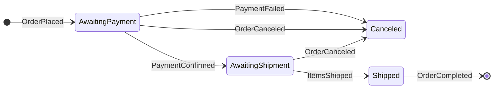

# Sequential Convoy

The **Sequential Convoy** is a messaging pattern that ensures a group of related messages are processed in a specific, sequential order by a single consumer instance. It solves the problem of handling ordered, stateful operations in a distributed system where messages might otherwise be processed in parallel or out of order by competing consumers.

This pattern is crucial for implementing complex, long-running business processes that depend on a sequence of steps. It acts as a state machine where each message in the "convoy" triggers a state transition, and the system ensures that only the correct message can be processed at each state.

## How It Works

The core of the pattern relies on three key components: correlation, ordered delivery, and stateful processing.

1.  **Correlation Identifier**: All messages belonging to the same convoy share a unique identifier (e.g., `OrderId`, `TransactionId`). This allows the system to group them together.
2.  **Stateful Consumer**: The consumer that processes the messages is stateful. It keeps track of the current step in the sequence for each convoy.
3.  **Ordered Processing Logic**: The consumer contains logic that defines the required order of messages. It will only process a message if it matches the expected next step in the sequence for that specific convoy.

When a message arrives, the consumer inspects its correlation ID and checks its internal state. If the message is the one it expects for that convoy, it processes it and updates its state to await the next message in the sequence. If an unexpected message arrives, it is either rejected, re-queued for later, or put aside in a separate queue.

### State Machine Diagram

A sequential convoy is best modeled as a state machine. Consider an e-commerce order process:

*Description: This state diagram shows a sequential convoy for an order. The process can only move from `AwaitingPayment` to `AwaitingShipment` after a `PaymentConfirmed` message arrives. Any other message for this order would be ignored or deferred until the correct one is received.*

## Key Benefits

-   **Guaranteed Order of Operations**: Ensures that dependent steps in a business process are executed in the correct sequence.
-   **Stateful Workflows**: Enables the implementation of complex, long-running, and stateful processes across distributed services.
-   **Reliability and Consistency**: By processing messages for a single business transaction sequentially, it simplifies error handling and helps maintain data consistency throughout the process.

## Challenges and Considerations

-   **Consumer Bottleneck**: Since all messages for a given convoy must be processed by a single consumer instance, that instance can become a bottleneck. This is a classic challenge of stateful services, often requiring "sticky sessions" or routing based on the correlation ID to ensure a message always lands on the correct, state-holding instance.
-   **State Management**: The consumer must reliably store its state. If the consumer crashes, it must be able to recover its state and resume processing where it left off. This often requires an external persistence mechanism (e.g., a database or a distributed cache like Redis).
-   **Handling Out-of-Order Messages**: The system needs a clear strategy for messages that arrive too early. Common approaches include using a temporary holding queue or simply rejecting them and letting the sender retry.
-   **Timeout and Escalation**: The process may get stuck if a message in the sequence is lost or never arrives. The system must have a timeout mechanism to detect stalled convoys and trigger a compensating action or an alert.

## Common Use Cases

-   **E-commerce Order Fulfillment**: Processing an order from placement to payment, shipping, and completion.
-   **Financial Transactions**: Multi-step financial operations that require a strict sequence of events (e.g., authorize, capture, settle).
-   **Workflow and Business Process Management (BPM)**: Any system that orchestrates a series of human or automated tasks.

## Related Patterns and Concepts

-   **[[saga|Saga Pattern]]**: A Sequential Convoy is a form of an *orchestration-based* saga, where a central orchestrator (the stateful consumer) directs the flow of the process. This contrasts with *choreography-based* sagas, which use events without a central controller.
-   **[[gof#state|State Pattern]]**: The internal logic of the consumer is a direct implementation of the State design pattern.
-   **[[message-queue|Message Queue]]**: The underlying infrastructure used to transport the messages.
-   **Competing Consumers Pattern**: The Sequential Convoy is an exception to the standard competing consumers model. While multiple consumer instances can run in parallel, only one can "win" the lock to process messages for a specific convoy instance.

---

## Resources & links

### Articles

1.  **[Sequential Convoy Pattern - Microsoft Azure](https://learn.microsoft.com/en-us/azure/architecture/patterns/sequential-convoy)**
    The official Azure Architecture Center documentation on the pattern, providing a clear overview and use cases.

2.  **[Sequential Convoys - BizTalk Server](https://learn.microsoft.com/en-us/biztalk/core/sequential-convoys)**
    Older documentation from Microsoft BizTalk Server, which provides deep technical context on one of the earliest enterprise implementations of this pattern.
