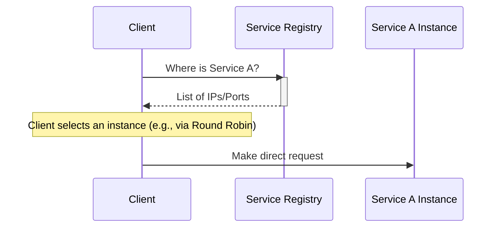
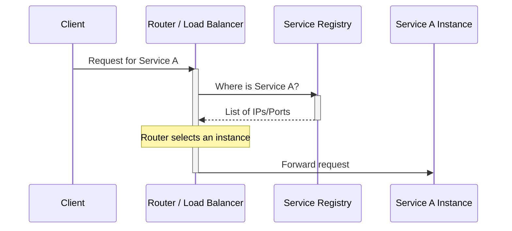
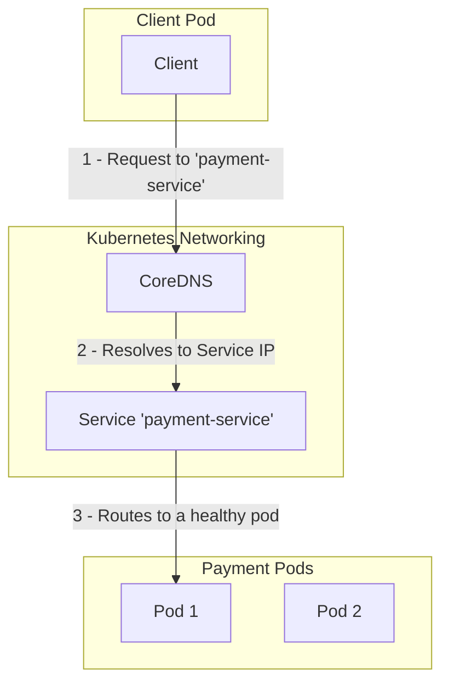

# Service Discovery Pattern

In a distributed architecture like [[microservices]], service instances are dynamic. They are created and destroyed frequently, and their network locations (IP addresses and ports) change constantly. The **Service Discovery** pattern is a crucial solution to this problem, providing a mechanism for services to find and communicate with each other without hard-coding network locations.

It acts as a dynamic, automated "phonebook" for your services.

---

## Core Components

1.  **Service Registry:** This is the heart of the pattern—a [[software-architecture/databases/|database]] containing the network locations of all available service instances. It's a central source of truth for service addresses.
2.  **Service Provider:** An instance of a service that registers its location in the Service Registry upon startup.
3.  **Service Consumer:** A client application or another service that needs to communicate with a provider. It queries the registry to find the provider's location.

---

## Discovery Patterns

There are two main approaches for how a consumer discovers a provider.

### 1. Client-Side Discovery

In this pattern, the client (consumer) is responsible for querying the Service Registry to get a list of available provider instances. The client then uses a client-side [[load-balancing|load-balancing]] algorithm (e.g., Round Robin) to select an instance and make a request directly.

*Description: The client is responsible for both querying the registry and selecting a service instance.*

-   **Pros:** Simple architecture with fewer moving parts.
-   **Cons:** Couples the client to the Service Registry. Requires implementing discovery and load-balancing logic in every client, which can be complex to manage across different programming languages.

### 2. Server-Side Discovery

This is the more common and powerful pattern. The client makes a request to a router or a [[load-balancing|Load Balancer]], which acts as an intermediary. This router queries the Service Registry and forwards the request to an available service instance. The client is completely unaware of the multiple instances or the registry itself.

*Description: The client makes a simple request to a router. The router handles the complexity of discovery and routing.*

-   **Pros:** Decouples the client from the discovery logic. Centralizes load balancing and routing concerns. Simpler for the client.
-   **Cons:** The router becomes another piece of critical infrastructure that must be highly available.

---

## Common Tools

Several tools provide Service Registry capabilities:

-   **Consul:** A full-featured solution from HashiCorp that provides service discovery, health checking, and a distributed key-value store.
-   **Etcd:** A highly available, distributed key-value store that is the primary datastore for Kubernetes. It can be used directly for service discovery in other systems.
-   **Apache Zookeeper:** An older but very mature coordination service, originally developed for the Hadoop ecosystem. It is widely used for service discovery, configuration management, and distributed locking.
-   **Netflix Eureka:** An early and influential service registry from Netflix, widely used within the Spring Cloud ecosystem. While it is now in maintenance mode, it established many of the patterns used by modern discovery tools.

---

## Implementation in Kubernetes

Kubernetes has a powerful, built-in service discovery mechanism that is a prime example of the **Server-Side Discovery** pattern.

-   **How it works:** You don't typically need an external tool like Consul inside a Kubernetes cluster. Instead, Kubernetes provides a `Service` object that acts as a stable endpoint for a set of pods. This `Service` gets a stable internal DNS name (e.g., `my-service.my-namespace.svc.cluster.local`). The internal CoreDNS server of the cluster automatically maps this DNS name to the `Service`'s IP address. The `Service` then uses labels to identify the pods it should route traffic to and acts as a built-in load balancer.

-   **The Flow:** A client pod simply makes a request to the stable DNS name (e.g., `http://payment-service`). Kubernetes transparently intercepts this request, resolves the DNS name to the correct service, and routes the traffic to one of the healthy backend pods for that service.

*Description: The client only needs to know the stable DNS name of the service. Kubernetes handles the discovery and routing to a healthy pod automatically.*

---

## Service Registration Strategies

How do service instances get into the registry?

1.  **Self-Registration:** The service instance is responsible for registering itself with the registry on startup and de-registering on shutdown. It must also send periodic **[[availability-patterns|heartbeats]]** to the registry to signal that it is still healthy.

2.  **Third-Party Registration:** An external tool, known as a **Registrar**, handles the registration process. In modern containerized environments, the container orchestrator (e.g., Kubernetes) often plays this role, automatically registering and de-registering services as they are deployed or terminated.

---

## Resources & links

### Articles

1.  **[System Design Primer - Service Discovery](https://github.com/donnemartin/system-design-primer#Service-Discovery)**
    A concise summary of Service Discovery, listing common tools like Consul, Etcd, and Zookeeper, and mentioning the use of health checks.

2.  **[What is Service Discovery? Complete guide [2025 Edition]](https://middleware.io/blog/service-discovery/)**
    A comprehensive guide covering the types, methods, and implementation strategies for service discovery in microservices architectures.

### Videos

1.  **[What is Service Discovery?](https://www.youtube.com/watch?v=v4u7m2Im7ng)**
    This video explains service discovery as a design pattern, covering client-side, server-side, and different registration mechanisms.

2.  **[Master Service Discovery in Microservices | Eureka and Java Spring](https://www.youtube.com/watch?v=ecuEkmFs5Vk)**
    This video breaks down the concept of Service Discovery and demonstrates its use with a practical Java/Spring Boot example using Netflix Eureka.
