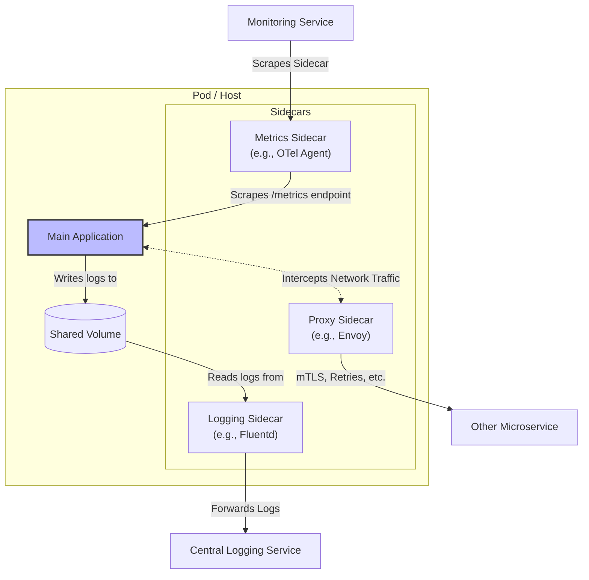
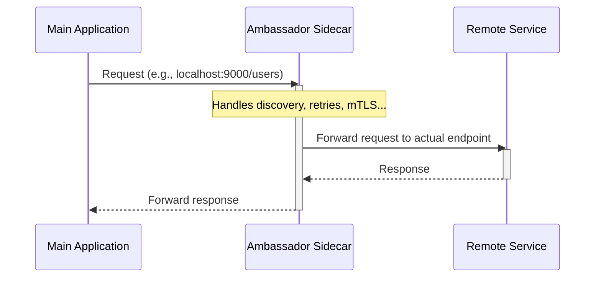

# Sidecar Pattern

The Sidecar pattern (also known as the **Sidekick pattern**) is a decomposition pattern where an application's components are deployed into a separate process or container for isolation and encapsulation. This pattern allows applications to be composed of heterogeneous components and technologies.

It is named **Sidecar** because it resembles a sidecar attached to a motorcycle. In the pattern, the sidecar is attached to a parent application and provides supporting features. The sidecar shares the same lifecycle as its parent—it is created, started, and stopped alongside it.


*A diagram illustrating common Sidecar use cases. A Proxy intercepts network traffic, a Logging sidecar reads from a shared volume, and a Metrics sidecar scrapes an endpoint, all supporting the Main Application.*

---

## The Problem it Solves

Many applications require auxiliary functionalities such as [[monitoring]], logging, configuration, and networking services. These cross-cutting concerns can be implemented as separate modules or services within the main application. However, this leads to several challenges:

-   **[[cohesion-coupling|Tight Coupling]]**: The auxiliary logic is tightly coupled with the application's core business logic.
-   **Technology Lock-in**: The components must be written in the same language/technology as the main application.
-   **No Isolation**: A failure or resource leak in an auxiliary component can crash or degrade the entire application.

The Sidecar pattern addresses these issues by co-locating these concerns in a separate, isolated process.

---

## Common Use Cases & Examples

The Sidecar pattern is extremely versatile and is a foundational element of many modern cloud-native practices.

1.  **Proxying and Networking (Service Mesh)**
    This is the most prominent use case. A sidecar proxy is deployed alongside each service instance to manage all inbound and outbound network traffic. It handles concerns like [[service-discovery]], [[load-balancing]], traffic encryption (mTLS), [[posa#Retry|retries]], and [[posa#Circuit Breaker|circuit breaking]]. This is the fundamental building block of a [[service-mesh]].
    -   **Technology**: Envoy, Linkerd.

2.  **[[software-architecture/observability/|Observability]] & [[monitoring|Monitoring]]**
    A sidecar can act as a local agent to collect and export [[monitoring|telemetry]], abstracting this task away from the application.
    -   **Log Collection**: A `fluentd` or `vector` sidecar can scrape log files from a shared volume and forward them to a centralized logging backend (like Elasticsearch or Loki).
    -   **Metrics Collection**: A sidecar can collect application metrics and expose them in a format that a central monitoring system (like Prometheus) can scrape.

3.  **Security**
    A sidecar can offload security-related tasks from the application.
    -   **TLS Termination**: The sidecar handles incoming TLS/SSL connections, decrypts the traffic, and forwards unencrypted requests to the main application over `localhost`.
    -   **Authentication/Authorization**: The sidecar can intercept incoming requests, validate authentication tokens, and enforce authorization policies before forwarding valid requests to the application.

4.  **Configuration Management**
    A sidecar can be responsible for fetching configuration data from a central store (like `etcd` or HashiCorp Consul) and keeping it up-to-date. It can then notify the main application of changes or provide the configuration via a shared file.

---

## Implementation in Kubernetes

[[kubernetes|Kubernetes]] makes the Sidecar pattern a natural fit through its **Pod** abstraction. A Pod is the smallest deployable unit in Kubernetes and can contain one or more containers that are co-located on the same host machine. Containers within the same Pod share:

-   A network namespace (they can communicate via `localhost`).
-   Storage volumes.
-   A lifecycle (they are started and stopped together).

**Example: NGINX with a Fluentd Logging Sidecar**

The following YAML defines a Pod with two containers. The main container runs NGINX, and the sidecar container runs Fluentd to collect and forward NGINX's access logs.

```yaml
apiVersion: v1
kind: Pod
metadata:
  name: nginx-with-sidecar
spec:
  containers:
  - name: nginx-app
    image: nginx
    volumeMounts:
    - name: log-volume
      mountPath: /var/log/nginx
  - name: logging-sidecar
    image: fluent/fluentd
    volumeMounts:
    - name: log-volume
      mountPath: /var/log/nginx
  volumes:
  - name: log-volume
    emptyDir: {}
```

---

## Considerations & Trade-offs

-   **Resource Overhead**: Each sidecar consumes its own CPU and memory. Deploying a sidecar for every application instance can significantly increase overall resource consumption.
-   **Latency**: While communication over `localhost` is very fast, it still introduces a small amount of latency compared to in-process function calls.
-   **Deployment Complexity**: The number of deployed components doubles, which can add complexity to your CI/CD pipelines and orchestration.

---

## The Ambassador Pattern: A Specialization

The **Ambassador** pattern is a specialized variant of the Sidecar pattern. While a general-purpose Sidecar can handle many tasks (logging, metrics, etc.), an Ambassador focuses specifically on acting as a proxy for **outbound network requests** from the main application to a remote service.

The application simply communicates with the Ambassador running on `localhost`, and the Ambassador handles the complexities of service discovery, routing, and resilient communication over the network.


*A sequence diagram showing how the Ambassador intercepts a local call from the application and manages the complexity of communicating with a remote service.*

This pattern is particularly useful for legacy applications that are difficult to modify, as it allows their networking capabilities to be extended and modernized without changing their code.

### Common Use Cases
- **Resilient Communication**: Automatically implement resilience patterns like [[posa#Retry|retries]] and [[posa#Circuit Breaker|circuit breakers]] for all outgoing calls, without polluting the application code.
- **Service Discovery & Routing**: The Ambassador can find a healthy instance of a remote service and route the request accordingly, shielding the main application from the complexity of a dynamic microservices environment.
- **Security**: It can secure outgoing traffic by transparently establishing a mutual TLS (mTLS) connection with the remote service.
- **Monitoring**: It can capture detailed metrics (latency, error rates, throughput) for all outgoing requests, providing crucial observability into external dependencies.

### Benefits & Trade-offs

-   **Benefit: Simplified Application Code**: Moves complex and repetitive network-related code out of the business logic and into a reusable, language-agnostic component.
-   **Benefit: Language Agnostic**: The resiliency and discovery logic is implemented once in the Ambassador and can be used by any application, regardless of its programming language.
-   **Trade-off: Latency**: Adds a single, very low-latency network hop (over `localhost`) compared to a direct library call.
-   **Trade-off: Deployment Complexity**: As with any sidecar, it increases the number of components to deploy and manage for each application instance.

---

## Related Patterns

-   **[[service-mesh]]**: The Sidecar pattern is the core implementation detail of a Service Mesh. The mesh's data plane is composed of sidecar proxies deployed next to each service.
-   **[[posa#Proxy|Proxy]]**: The sidecar itself is often implemented as a Proxy, as it intercepts and manages communication on behalf of the main application.

---

## Resources & links

### Articles

1.  **[Sidecar pattern - Microsoft Azure](https://learn.microsoft.com/en-us/azure/architecture/patterns/sidecar)**
    The official Microsoft documentation for the Sidecar pattern, providing a detailed overview of the problem it solves, its use cases, and implementation considerations.

2.  **[Sidecar Design Pattern for Microservices - GeeksforGeeks](https://www.geeksforgeeks.org/system-design/sidecar-design-pattern-for-microservices/)**
    A clear article explaining how the Sidecar pattern is used in microservice architectures to handle auxiliary tasks like logging, monitoring, and security.

3.  **[Ambassador pattern - Microsoft Azure](https://learn.microsoft.com/en-us/azure/architecture/patterns/ambassador)**
    The official documentation for the Ambassador pattern, explaining its role as an out-of-process proxy for client connectivity tasks.

### Videos

1.  **[Sidecar Pattern in Microservices - Code With Dary](https://www.youtube.com/watch?v=sh2nwXJLDkE)**
    A concise video explaining how the Sidecar pattern simplifies microservices by offloading tasks like logging and monitoring to a helper component.

2.  **[Sidecar Pattern to SIMPLIFY services or just more COMPLEXITY... - ByteByteGo](https://www.youtube.com/watch?v=9zAjtcf9Wyo)**
    This video discusses the Sidecar and Ambassador patterns as solutions for handling generic concerns like health checks, configuration, and metrics across multiple services.
