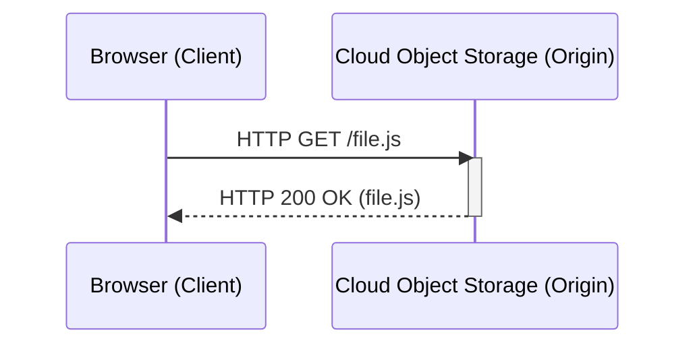
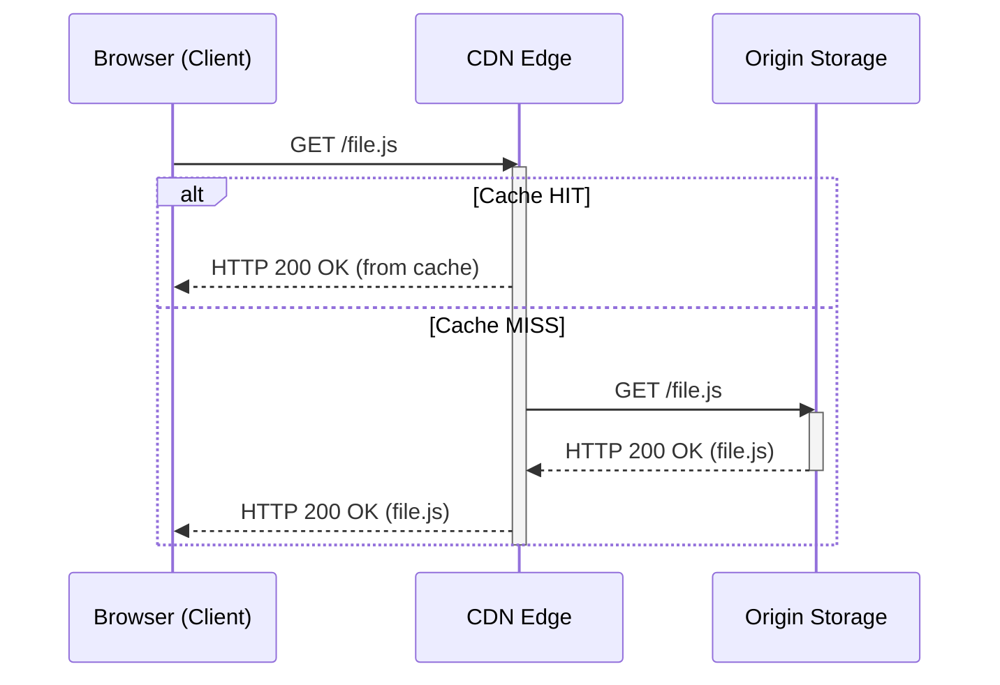

# Static Content Hosting Pattern

The Static Content Hosting pattern is a method for deploying static assets (HTML, CSS, JavaScript, images, videos) to a cloud-based storage service that can deliver them directly to the client. This approach, especially when paired with a [[cdn|Content Delivery Network (CDN)]], avoids the need for traditional, dynamic web server compute instances, leading to significant cost savings and operational benefits.

The core idea is to use highly scalable and durable object storage services as the web server origin.
- **Examples of Providers**: Amazon S3, Google Cloud Storage, Azure Blob Storage.

*A sequence diagram showing the client making a direct HTTP request to the cloud storage origin and receiving the file in response.*

---

## The Problem it Solves

Traditionally, web servers running on compute instances (like VMs or EC2) were responsible for serving all content, both dynamic and static. Using a compute instance just to serve static files is highly inefficient:

-   **High Cost**: You pay for a server to be running 24/7, even when there is no traffic.
-   **Wasted Resources**: The server's CPU and memory are largely idle, waiting to perform simple I/O operations.
-   **Scaling Complexity**: You are responsible for scaling the compute instances to handle traffic spikes, which adds operational overhead.

This pattern solves these issues by offloading the responsibility of serving static files to a managed service designed for that exact purpose.

---

## Key Considerations & Related Patterns

While simple in principle, making this pattern performant and efficient requires considering two related concepts: **caching** and **content delivery**.

### 1. Cache Control

Even without a CDN, caching plays a vital role via the client's browser. To prevent the browser from re-downloading the same asset on every page load, you must configure the correct [[communication-protocols|HTTP headers]] on your stored objects. This is a direct application of the `[[caching]]` principle.

-   `Cache-Control`: This is the most important header. For versioned assets (e.g., `styles.a1b2c3.css`), you can set a very long cache lifetime: `Cache-Control: public, max-age=31536000` (1 year). For files like `index.html` that may change, you might use a shorter lifetime or `no-cache` to force revalidation.
-   `ETag`: An identifier for a specific version of a resource. The browser can use it to ask the server if the file has changed since the last request, avoiding a full re-download if it hasn't.

### 2. Content Delivery Network (CDN)

Cloud object storage is highly scalable but typically located in a single geographic region. To provide low-latency access to a global user base, the Static Content Hosting pattern is almost always paired with a **`[[cdn]]`**.

In this setup, the object storage acts as the **origin**, and the CDN pulls the content from it, distributing and caching it in dozens or hundreds of edge locations around the world. The user is transparently served by the nearest edge location, dramatically reducing [[software-architecture/system-design-fundamentals/index#Latency vs. Throughput|latency]].

*The complete pattern: a sequence diagram showing both Cache Hit and Cache Miss scenarios when a client requests a file from a CDN.*

---

## Benefits

-   **Cost-Effectiveness**: You pay only for the storage and bandwidth you use, which is significantly cheaper than running idle compute instances.
-   **[[software-architecture/system-design-fundamentals/index#Scalability|High Scalability]]**: Object storage services are built to handle virtually limitless traffic and data volume with no manual intervention.
-   **[[availability|High Availability]] & Durability**: These services are inherently redundant and provide extremely high durability guarantees for your files.
-   **Reduced Operational Overhead**: There are no servers to manage, patch, or scale, freeing up development teams to focus on the application itself.

---

## Resources & links

### Articles

1.  **[Static Content Hosting pattern - Microsoft Azure](https://learn.microsoft.com/en-us/azure/architecture/patterns/static-content-hosting)**
    The official Microsoft documentation for the pattern, which defines it as a way to reduce the need for expensive compute instances by deploying static content to a cloud-based storage service.

2.  **[Static Content Hosting Pattern - System Design - GeeksforGeeks](https://www.geeksforgeeks.org/system-design/static-content-hosting-pattern-system-design/)**
    An article covering how this pattern uses object storage and CDNs to efficiently deliver static files like images, HTML, and CSS.
