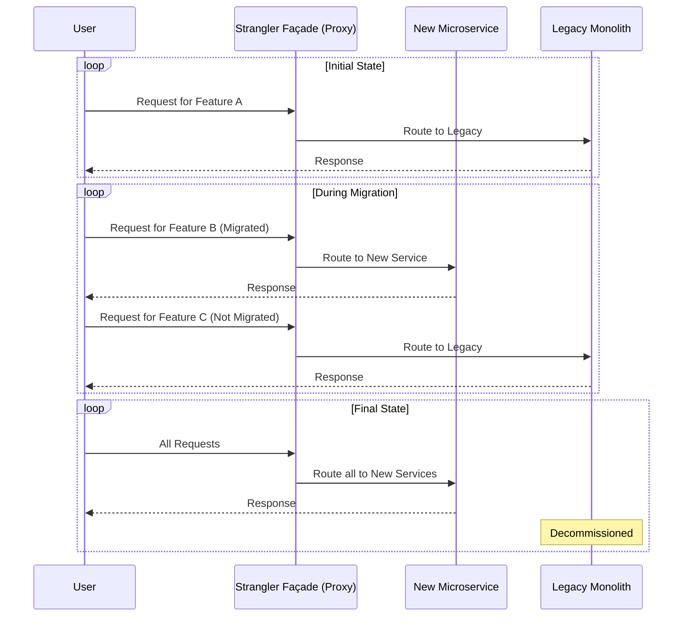

# Strangler Fig Pattern

The **Strangler Fig Pattern** is an [[software-architecture/architectural-patterns/|architectural pattern]] for incrementally migrating a legacy system by gradually replacing specific pieces of functionality with new applications and services. The name, coined by Martin Fowler, comes from the analogy of a strangler fig tree, which grows around an older tree, eventually enveloping and replacing it.

Instead of a high-risk "big bang" rewrite, the strangler fig approach allows you to build a new, modern system around the edges of the old one. Over time, the new system grows and intercepts more and more functionality until the legacy system is "strangled" and can be safely decommissioned.

* **Core Principles:**
    * **Incremental Replacement:** Functionality is migrated piece by piece, not all at once.
    * **Reduced Risk:** The migration is gradual, allowing for continuous testing and validation. This avoids the high risk associated with a single, large-scale deployment.
    * **Coexistence:** The new and old systems run in parallel, often for an extended period.
    * **Proxying/Interception:** A routing mechanism is put in place to direct traffic to either the new functionality or the legacy system.

---

## Key Components and Communication Flow

The pattern relies on an intermediary that intercepts requests and routes them appropriately.

1.  **Legacy System:** The original [[monolithic|monolithic application]] that is being replaced.
2.  **New System:** The modern application, typically composed of [[microservices]], that is gradually implementing the new functionality.
3.  **Strangler Façade (or Proxy/Router):** This is the critical intermediary component that sits in front of the legacy system. It intercepts all incoming requests and makes a routing decision:
    *   If the requested functionality has been migrated, it routes the call to the new service.
    *   Otherwise, it passes the call through to the legacy system.

**Typical Migration Flow:**
1.  **Identify a Module:** A small, well-defined piece of functionality in the legacy system is chosen for migration.
2.  **Implement the Façade:** A proxy or router is placed in front of the legacy system to intercept traffic.
3.  **Build the New Service:** The functionality is rebuilt as a new, independent service.
4.  **Switch the Route:** The façade is configured to route traffic for the migrated feature to the new service. All other traffic continues to flow to the legacy system.
5.  **Repeat:** The process is repeated for other modules, gradually "strangling" the legacy system until it has no remaining responsibilities and can be shut down.

---

## Advantages and Technical Challenges

* **Advantages (Benefits):**
    * **Reduced Migration Risk:** Avoids the "big bang" rewrite, where a single failure can derail the entire project. Value is delivered incrementally.
    * **Zero Downtime:** The migration can be performed on a live system without interrupting service for users.
    * **Immediate Value:** New features can be added to the modern system while the migration is in progress, providing immediate business value.
    * **Spreadable Investment:** The cost and effort of the migration are spread over time.

* **Challenges:**
    * **Façade Complexity:** The strangler façade can become a complex piece of software, especially if it needs to handle complex routing rules or data transformation.
    * **Data Synchronization:** Managing data consistency between the new services and the legacy database is often the biggest challenge. Patterns like the **Anti-Corruption Layer** may be needed to translate between the old and new data models.
    * **Long-Term Maintenance:** For a long period, two systems must be maintained, monitored, and operated in parallel, which can increase operational overhead.
    * **Integration Hell:** As more services are added, managing dependencies and communication between the new services and the legacy system can become complicated.

---

## Related Patterns, Concepts and Variations

*   **[[microservices|Microservices]]:** The Strangler Fig pattern is one of the most common and recommended strategies for migrating a monolith to a microservices architecture.
*   **[[modular-monolith|Modular Monolith]]:** A modular monolith can be an excellent starting point for a strangler fig migration. Once the modules are well-defined, they are easier to "strangle" and extract into independent services.
*   **Anti-Corruption Layer (ACL):** Often used in conjunction with the Strangler Fig pattern. The ACL is a translation layer that isolates the new system from the legacy system's data model, preventing "leaky" or outdated concepts from polluting the new domain model.
*   **[[posa#proxy|Proxy]] and [[gof#facade|Façade]] Patterns:** The Strangler Façade is a specific application of these classic design patterns.

---

## **Resources & links**

### **Articles**

1.  **[StranglerFigApplication by Martin Fowler](https://martinfowler.com/bliki/StranglerFigApplication.html)**

    The original article by Martin Fowler that named and defined the pattern. It provides the foundational analogy and explains the core concept of gradually replacing a legacy system.

2.  **[Strangler Fig Pattern (Microsoft Learn)](https://learn.microsoft.com/en-us/azure/architecture/patterns/strangler-fig)**

    A detailed guide from Microsoft that covers the pattern's implementation, benefits, and challenges, with a focus on cloud and microservices contexts.

### **Videos**

1.  **[Strangler Fig Pattern | System Design | Migrate Monolithic Application to Microservices Architecture](https://www.youtube.com/watch?v=MV11JStATVE)**

    This video from **SoftwareDude** explains the Strangler Fig pattern, showing a scenario for achieving the pattern and discussing its benefits and considerations for migrating from a monolith to a microservices architecture.

2.  **[Master Microservices Strangler Pattern by Top AWS Experts](https://www.youtube.com/watch?v=DpuQ3-7e-rY)**

    This video from **ByteMonk** features AWS experts discussing the Strangler Fig pattern as a key strategy for microservices migration, providing insights from top industry practitioners.