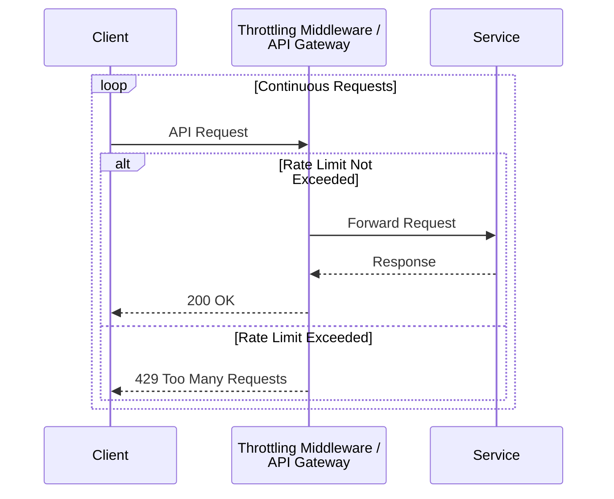

# Throttling Pattern

The **Throttling** pattern is a design strategy used to control the consumption of resources by an application or service. It works by limiting the rate at which requests are processed. When the defined limit is exceeded, new requests are temporarily rejected, allowing the system to continue functioning under heavy load without being overwhelmed. This is a critical pattern for maintaining system [[availability]] and meeting Service Level Agreements (SLAs).

Throttling is essential for preventing a single user, tenant, or a sudden spike in traffic from exhausting system resources (like CPU, memory, or bandwidth) and causing a widespread outage.

*Description: The throttling middleware intercepts incoming requests. If the number of requests within a given time window is below the threshold, they are forwarded to the service. Once the limit is reached, subsequent requests are rejected with an HTTP 429 status code.*

---

## Why Use Throttling?

- **Prevent Overload:** Protects backend services from being overwhelmed by traffic spikes, which could lead to cascading failures.
- **Ensure Fair Usage:** In a multi-tenant system, throttling ensures that no single tenant can monopolize resources and degrade the service for others. This is a key aspect of [[workload-management|Workload Management]].
- **Manage Costs:** In cloud environments, uncontrolled resource consumption can lead to unexpectedly high costs. Throttling helps enforce budget limits.
- **Security:** Provides a defense against malicious attacks such as Denial-of-Service (DoS) or brute-force login attempts.

---

## Throttling vs. Rate Limiting vs. Back Pressure

These terms are closely related and often used interchangeably, but they have subtle differences:

- **Throttling:** A broad term for controlling resource consumption. It's often server-side and focuses on protecting the service's own resources.
- **[[rate-limiting|Rate Limiting]]:** A specific type of throttling that limits the number of requests a user can make in a given time window. It's often used for API security and to enforce commercial agreements (e.g., API tiers).
- **[[back-pressure|Back Pressure]]:** A related concept where downstream services signal to upstream services that they are overloaded. Instead of just dropping requests, the system as a whole slows down, pushing the "pressure" back to the original caller.

---

## Implementation Strategies

Throttling can be implemented at different layers of the application stack.

### Where to Implement Throttling

1.  **API Gateway:** Implementing throttling at the [[api-gateway|API Gateway]] is a common approach. It provides a centralized point of control for all incoming traffic before it hits your services.
2.  **Load Balancer:** Some advanced [[load-balancing|load balancers]] offer throttling capabilities.
3.  **Application Middleware:** Throttling logic can be built directly into the application as a middleware component. This allows for more fine-grained control based on application-specific logic.

### Common Throttling Algorithms

The logic for tracking request rates is typically implemented using one of these algorithms:

- **Token Bucket:** A bucket is filled with "tokens" at a fixed rate. Each request requires a token to be processed. If the bucket is empty, the request is rejected. This algorithm allows for bursts of traffic as long as there are tokens in the bucket.
- **Leaky Bucket:** Requests are added to a queue (the bucket). The bucket is processed at a fixed rate, like a leak. If the queue is full, new requests are rejected. This algorithm is good for smoothing out requests into a steady stream.

### Responding to Throttled Clients

When a request is throttled, it's crucial to provide clear feedback to the client. The standard approach is to return an **HTTP 429 "Too Many Requests"** status code.

It is also a best practice to include a `Retry-After` header in the response. This header tells the client how long to wait (in seconds) before making another request, allowing well-behaved clients to implement a proper backoff strategy.

---

## Benefits

- **Improved Availability and Reliability:** Prevents system failures due to resource exhaustion.
- **Predictable Performance:** Ensures the system operates within its known capacity, providing a consistent quality of service.
- **Enhanced Security:** Protects against certain types of malicious attacks.
- **Better User Experience (for well-behaved clients):** By preventing total system failure, it ensures the service remains available for the majority of users.

## Challenges

- **Setting the Right Thresholds:** Determining the correct throttling limits is difficult. If limits are too low, you block legitimate traffic and harm the user experience. If they are too high, the system is not adequately protected. Limits often need to be dynamic and adjusted based on monitoring.
- **Client-Side Handling:** The effectiveness of throttling relies on clients respecting the 429 responses and implementing a [[retry]]/backoff strategy. Poorly behaved clients may continue to hammer the API, exacerbating the problem.
- **Distributed Systems Complexity:** In a large distributed system, implementing a global throttling limit that is shared across all nodes can be technically challenging. It often requires a centralized, high-performance data store (like Redis) to track counts.

---

## Resources & Links

### Articles

1.  **[Throttling pattern - Azure Architecture Center](https://learn.microsoft.com/en-us/azure/architecture/patterns/throttling)**
    The official Microsoft documentation provides a comprehensive overview of the pattern. It details the problem it solves (managing resource consumption under load) and discusses various strategies, such as rejecting requests, degrading functionality, and load leveling. The article emphasizes the importance of returning specific error codes (like 429 or 503) and including a `Retry-After` header to guide client behavior.

2.  **[The pros and cons of the Throttling architecture pattern - Red Hat](https://www.redhat.com/en/blog/pros-and-cons-throttling)**
    This article from Red Hat offers a balanced view of the throttling pattern. It highlights the primary benefit of preventing catastrophic failure under load, including from DDoS attacks, and its role in cost control. It also points out the cons, such as the inherent performance degradation during throttling events and the complexity of implementing it correctly, noting that it's a significant architectural decision that should be made early in the design process.

3.  **[Throttling pattern. It is actually controlling the usage of… | by Jacob Just](https://jacobjustcoding.medium.com/throttling-pattern-f1d80350beaa)**
    This Medium post provides a practical developer-oriented explanation of the throttling pattern. It frames throttling as a way to ensure system stability and meet SLAs by controlling resource usage over time. The author discusses how throttling can be combined with autoscaling, acting as a temporary buffer that keeps the system responsive while new resources are provisioned.