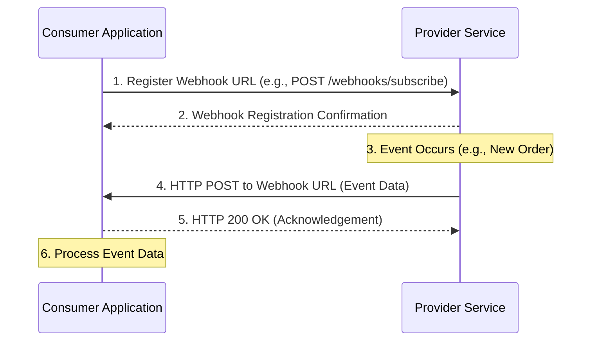

# Webhooks

Webhooks are an [[asynchronous-messaging|asynchronous messaging]] pattern that enables [[real-time-communication|real-time]], **server-to-server** communication. Unlike traditional [[rest|REST APIs]] where the client actively polls a server for updates, Webhooks allow a server (the "provider" or "publisher") to push information to another server (the "consumer" or "subscriber") as soon as an event occurs. They are often described as "user-defined HTTP callbacks."

Essentially, a Webhook is a mechanism where a user or application registers a specific URL (the "payload URL" or "callback URL") with a service. When a designated event happens within that service, it makes an HTTP POST request to the registered URL, sending data about the event. This eliminates the need for constant polling, making integrations more efficient and responsive.

## How Webhooks Work

The process of using a Webhook typically involves three main steps:

1.  **Registration (Subscription):** The consumer application registers a URL with the provider service. This URL is where the provider will send event data. This step often involves configuring the Webhook through the provider's API or a user interface. The consumer might also specify which types of events it wants to receive.
2.  **Event Trigger:** A specific event occurs within the provider service (e.g., a new order is placed, a code repository receives a push, a payment status changes).
3.  **Notification (HTTP POST):** The provider service detects the event and constructs an HTTP POST request containing data about the event. This request is then sent to the consumer's registered URL. The consumer's endpoint receives this request and processes the event data.

*A consumer registers a URL with a provider. When an event occurs, the provider sends an HTTP POST request with event data to the registered URL.*

## Advantages and Disadvantages

### Advantages
*   **Real-time Updates:** Provides immediate notification of events, eliminating the latency and resource overhead of polling.
*   **Efficiency:** Reduces unnecessary network traffic and server load for both the provider and consumer, as data is only sent when relevant.
*   **Simplicity:** Relatively easy to implement for both providers and consumers, leveraging standard HTTP.
*   **Decoupling:** Allows services to interact without tight coupling, as the provider doesn't need to know the internal logic of the consumer, only its callback URL.

### Disadvantages
*   **Security Concerns:** Exposing an endpoint to receive data from external services can introduce security risks. Proper authentication, signature verification, and HTTPS are crucial.
*   **Reliability and Delivery Guarantees:** Webhooks typically rely on a "fire-and-forget" mechanism. If the consumer's endpoint is down or unresponsive, the event might be lost unless the provider implements retry mechanisms or a [[message-queue|message queue]] for failed deliveries.
*   **Idempotency:** Consumer endpoints must be [[idempotent-operations|idempotent]] to handle duplicate deliveries gracefully, as providers might retry sending notifications.
*   **Management Complexity:** Managing multiple Webhooks for different events and consumers can become complex, especially for providers.
*   **Firewall/NAT Issues:** Consumer endpoints behind firewalls or Network Address Translation (NAT) may not be directly accessible by the provider, requiring tunneling solutions.

## Security Considerations

Given that Webhooks involve external services making requests to your endpoints, security is paramount:

*   **Use HTTPS:** Always ensure your Webhook endpoint uses HTTPS to encrypt data in transit.
*   **Signature Verification:** Providers should sign their Webhook payloads with a shared secret. Consumers should verify this signature to ensure the request genuinely came from the provider and hasn't been tampered with.
*   **Secret Management:** Treat Webhook secrets like any other sensitive credential.
*   **IP Whitelisting:** If possible, restrict incoming Webhook requests to a whitelist of IP addresses belonging to the provider.
*   **Idempotency:** Design your Webhook handlers to be [[idempotent-operations|idempotent]] to prevent issues from duplicate deliveries.
*   **Rate Limiting:** Implement [[rate-limiting]] on your Webhook endpoints to protect against abuse.

## Webhooks vs. Polling vs. Real-Time Communication

Webhooks are often compared to polling and other [[real-time-communication|real-time communication patterns]]:

*   **Polling:** The client repeatedly asks the server for new data. Inefficient for infrequent updates, high latency.
*   **Webhooks:** The server pushes data to the client (another server) when an event occurs. Efficient for infrequent updates, low latency, server-to-server.
*   **[[real-time-communication#WebSockets|WebSockets]] / [[real-time-communication#Server-Sent Events (SSE)|Server-Sent Events (SSE)]]:** The server pushes data to a client (typically a browser or mobile app) over a persistent connection. Efficient for frequent updates, very low latency, server-to-client.

Webhooks are best suited for integrating different backend systems where immediate notification of events is required without maintaining a persistent connection.

## Use Cases

Webhooks are widely used for various integrations and automation tasks:

*   **CI/CD Pipelines:** Triggering builds or deployments when code is pushed to a repository (e.g., GitHub Webhooks).
*   **Payment Gateways:** Notifying an e-commerce platform about successful payments, refunds, or chargebacks.
*   **Chat Applications:** Receiving notifications for new messages or events in a chat platform.
*   **CRM/ERP Systems:** Synchronizing data between different business applications when records are updated.
*   **Monitoring and Alerting:** Sending alerts to external systems when specific metrics cross thresholds.

---

## Resources & Links

### Articles

1.  **[What is a webhook? - Red Hat](https://www.redhat.com/en/topics/automation/what-is-a-webhook)**
    This article provides a foundational overview of Webhooks as a lightweight, event-driven communication method. It explains how they use HTTP to send automated data between applications when specific events occur, thus eliminating the need for inefficient polling.

2.  **[What are webhooks and how do they work? - Hookdeck](https://hookdeck.com/webhooks/guides/what-are-webhooks-how-they-work)**
    A detailed guide from Hookdeck that breaks down the mechanics of Webhooks. It covers how they are triggered by events, how the data payload is constructed, and how they enable real-time communication between different online services through automated HTTP requests.

3.  **[When to Use Webhooks, WebSocket, Pub/Sub, and Polling - Hookdeck](https://hookdeck.com/webhooks/guides/when-to-use-webhooks)**
    This comparative guide helps architects choose the right communication pattern for their needs. It clarifies that Webhooks are ideal for real-time, one-way, server-to-server communication with a non-persistent connection, particularly for reacting to events from SaaS applications.

4.  **[What Are Webhooks? - Zapier](https://zapier.com/blog/what-are-webhooks/)**
    Zapier offers a beginner-friendly explanation, framing Webhooks as automated messages that allow different web applications to "speak" to each other. It clearly explains the core concepts of the payload and the unique callback URL.