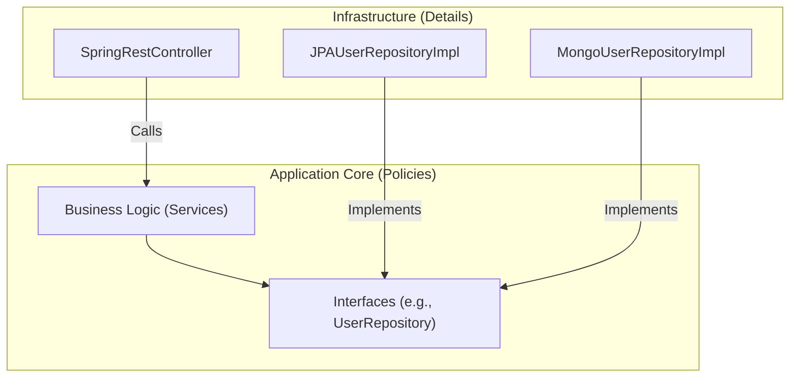

# Clean Code Principles

Clean Code is a set of principles and practices aimed at writing code that is easy to read, understand, and maintain. It is not about a specific language or framework but about a mindset focused on craftsmanship and quality. Clean code is self-documenting, simple, and has a clear, focused purpose.

The following principles are guidelines for achieving clean code.

* [Be Consistent](#be-consistent)
* [Meaningful Names Over Comments](#meaningful-names-over-comments)
* [Indentation and Code Style](#indentation-and-code-style)
* [Keep Methods, Classes, and Files Small](#keep-methods-classes-and-files-small)
* [Pure Functions](#pure-functions)
* [Minimize Cyclomatic Complexity](#minimize-cyclomatic-complexity)
* [Avoid Passing Nulls and Booleans](#avoid-passing-nulls-and-booleans)
* [Keep Framework Code Distant](#keep-framework-code-distant)
* [Use Correct Constructs](#use-correct-constructs)
* [Tests Should Be Fast and Independent](#tests-should-be-fast-and-independent)
* [Organize Code by the Actor It Belongs To](#organize-code-by-the-actor-it-belongs-to)
* [Command Query Separation (CQS)](#command-query-separation-cqs)
* [Keep It Simple and Refactor Often](#keep-it-simple-and-refactor-often)

---

## Be Consistent
**Explanation:** Consistency is a cornerstone of maintainable software. It means applying uniform rules and patterns across the entire codebase, which makes the system predictable and easier for developers to understand. When a developer can make reliable assumptions about how different parts of the code will look and behave, they can navigate and contribute to it more efficiently.

Consistency should be applied at multiple levels:

*   **Naming and Formatting:** Using consistent naming conventions (e.g., `camelCase` for methods, `PascalCase` for classes) and a shared code style (enforced by tools like formatters and linters) is the most basic level of consistency.
*   **Data Structures and Interfaces:** Use similar data structures for similar problems. For example, consistently use `Optional` to handle absent values or ensure all service interfaces are asynchronous and return `Future`/`Promise` objects. This creates a predictable API contract.
*   **Design and Architectural Patterns:** Adhere to the established design principles and patterns chosen for the project. If the team decides to use the [[poeaa#Repository|Repository pattern]] for data access, it should be used everywhere data access is needed. This architectural integrity prevents the system from devolving into a mix of conflicting styles.

By maintaining consistency, you create a system that is more understandable, maintainable, and extensible.

**Example:**
```java
// Inconsistent
public List<User> get_users() { /* ... */ }
class userProfile { /* ... */ }
String user_name = "John";

// Consistent
public List<User> getUsers() { /* ... */ }
class UserProfile { /* ... */ }
String userName = "John";
```

## Meaningful Names Over Comments
**Explanation:** The names of variables, functions, and classes are the most fundamental elements of readable code. This principle advocates for choosing clear, descriptive names that make the code self-documenting. The goal is to communicate the purpose and intended usage of each component so clearly that explanatory comments become unnecessary.

While comments can be useful, they often become a crutch for poor naming. Unlike a name, which is tied to the code, a comment is separate metadata that can easily become outdated and misleading as the code evolves. A name that reveals its intent is always more reliable.

**Guidelines for Naming:**

*   **Variables:** Should be nouns that clearly describe the value they hold. Avoid single-letter names (except for simple loop counters) or generic names like `data`, `temp`, or `list`.
*   **Functions/Methods:** Should be verb phrases that describe the action they perform. A good method name allows a developer to understand what it does without reading its implementation.
*   **Classes:** Should be nouns or noun phrases that represent the object or concept being modeled, such as `Order`, `Customer`, or `InvoiceCalculator`.

**Example:**
```java
// Bad: Name is too generic and requires a comment
int d; // elapsed time in days

// Good: Name is self-documenting
int elapsedTimeInDays;

// Bad: Method name is vague
void process(List<User> data) {
  // ... logic to filter out inactive users
}

// Good: Method name clearly describes what it does
List<User> filterInactiveUsers(List<User> userList) {
  // ... logic
}
```

## Indentation and Code Style
**Explanation:** While the compiler doesn't care about whitespace, humans do. A consistent indentation and code style are critical for readability and team collaboration. They are not matters of personal preference but professional discipline.

*   **Indentation:** Refers to the practice of using whitespace (tabs or spaces) at the beginning of a line to show the structure and nesting of code blocks. Proper indentation makes control flow (like loops and `if` statements) immediately obvious.
*   **Code Style:** Is a broader set of conventions that govern how code is written. This includes rules for brace placement, spacing around operators, naming conventions, and line length.

The specific style guide chosen is less important than the fact that the entire team adheres to it consistently. To eliminate debates and enforce this automatically, modern development teams rely on tools like **Checkstyle** and built-in IDE formatters (**IntelliJ**, **Eclipse**) to maintain a uniform style across the project.

**Example:**
```java
// Bad: Inconsistent and hard to read
public void processUsers(List<User> users){
for(User user:users){
if(user.isActive()){
System.out.println("Processing user: "+user.getName());
//... more logic
}
}
}

// Good: Clean, consistent, and readable
public void processUsers(List<User> users) {
    for (User user : users) {
        if (user.isActive()) {
            System.out.println("Processing user: " + user.getName());
            // ... more logic
        }
    }
}
```

## Keep Methods, Classes, and Files Small
**Explanation:** This principle advocates for designing small, focused components that each serve a single, specific purpose. It is a direct application of the **[[solid#Single Responsibility Principle (SRP)|Single Responsibility Principle]]** at every level of the code: from a single function to the file it resides in.

*   **Methods:** A method should be short and do only one thing. When a method has a single, clear purpose, it is easier to name, understand, and—most importantly—test. If you can't describe what a function does without using the word "and," it's probably doing too much.

*   **Classes:** A class should have only one reason to change. By keeping classes small and focused on a single responsibility, you create highly cohesive components. This makes the system easier to maintain because changes are localized. Modifying a focused class is less likely to have unintended consequences across the application.

*   **Files:** A source file should be small and represent a single, cohesive concept. In class-based languages like Java, this typically means one public class per file. In other languages (like JavaScript or Python), it might mean a single component, module, or a group of closely related functions. Large files are a code smell, indicating that a module has too many responsibilities and should be split.

*   **System-wide Benefits:** Building a system from small, interchangeable parts improves overall maintainability and scalability. It is far easier to understand, test, and safely modify an individual, focused component than it is to change a large one with many entangled responsibilities.

**Example:**
Let's consider a service that handles user registration.

```java
// Bad: A single class and method with multiple responsibilities
// File: UserRegistrationService.java
class UserRegistrationService {
    public void registerUser(String email, String password) {
        // 1. Validation
        if (email == null || !email.contains("@")) {
            throw new IllegalArgumentException("Invalid email");
        }
        if (password == null || password.length() < 8) {
            throw new IllegalArgumentException("Password too short");
        }

        // 2. Business Logic (hashing)
        String hashedPassword = BCrypt.hash(password);
        User user = new User(email, hashedPassword);

        // 3. Data Persistence
        Database db = new Database();
        db.save(user);

        // 4. Notification
        EmailGateway emailGateway = new EmailGateway();
        emailGateway.sendWelcomeEmail(email);
    }
}
```
This `registerUser` method is doing too much: validation, password hashing, [[software-architecture/databases/|database]] saving, and sending emails. This makes it hard to test and maintain.

```java
// Good: Responsibilities are split into small, focused classes and files.

// File: UserValidator.java
class UserValidator {
    public void validate(String email, String password) {
        if (email == null || !email.contains("@")) {
            throw new IllegalArgumentException("Invalid email");
        }
        if (password == null || password.length() < 8) {
            throw new IllegalArgumentException("Password too short");
        }
    }
}

// File: UserRepository.java
class UserRepository {
    private final Database db = new Database();
    public void save(User user) {
        db.save(user);
    }
}

// File: NotificationService.java
class NotificationService {
    private final EmailGateway emailGateway = new EmailGateway();
    public void sendWelcomeEmail(String email) {
        emailGateway.sendWelcomeEmail(email);
    }
}

// File: UserRegistrationService.java
class UserRegistrationService {
    private final UserValidator validator = new UserValidator();
    private final UserRepository repository = new UserRepository();
    private final NotificationService notifier = new NotificationService();
    private final PasswordEncoder encoder = new PasswordEncoder(); // e.g., BCrypt wrapper

    public void registerUser(String email, String password) {
        validator.validate(email, password);
        String hashedPassword = encoder.encode(password);
        User user = new User(email, hashedPassword);
        repository.save(user);
        notifier.sendWelcomeEmail(email);
    }
}
```
In the "Good" example:
- Each class has a single responsibility (`UserValidator`, `UserRepository`, `NotificationService`).
- Each class would be in its own file, making the project structure clean.
- The `UserRegistrationService` is now a simple coordinator, and its `registerUser` method is much easier to read and understand. It delegates the work to other specialized components.

## Pure Functions
**Explanation:** A pure function is a fundamental concept from **[[functional-programming|Functional Programming]]** that treats functions like mathematical operations. For a function to be considered "pure," it must adhere to two strict rules:

1.  **Deterministic:** It must always produce the same output for the same set of inputs. Its return value depends *only* on the arguments it receives.
2.  **No Side Effects:** It must not cause any observable change outside of its own scope. This means it cannot modify global variables, change the state of its input arguments, write to a [[software-architecture/databases/|database]], log to the console, or interact with any external system.

Because pure functions are self-contained and predictable, they offer significant advantages:

*   **Testability:** They are incredibly easy to test. Since their output is solely determined by their input, you don't need to mock complex dependencies or set up a specific system state.
*   **Predictability:** You can reason about the behavior of a pure function in isolation, without worrying about external factors or hidden state changes, which simplifies debugging and maintenance.
*   **Concurrency Safety:** Pure functions are inherently safe to run in parallel. Since they don't modify shared state, they are immune to race conditions and other concurrency-related bugs.

This predictability and safety make them a cornerstone of writing robust and maintainable code.

**Example:**
```java
// Impure: Modifies instance state (side effect)
class Calculator {
    private int total = 0;
    public int addToTotal(int amount) {
        this.total += amount;
        return this.total;
    }
}

// Pure: All dependencies are passed in, and it returns a new value
class PureCalculator {
    public static int calculateNewTotal(int currentTotal, int amount) {
        return currentTotal + amount;
    }
}
```

## Minimize Cyclomatic Complexity
**Explanation:** Cyclomatic complexity is a software metric that quantifies the complexity of a program by counting the number of linearly independent paths through its source code. In simpler terms, it measures how many distinct routes can be taken through a function. High complexity, often resulting from numerous `if-else` statements, `switch` cases, and loops, makes code difficult to understand, test exhaustively, and maintain safely.

To minimize cyclomatic complexity and improve code quality, consider the following strategies:

*   **Decompose Complex Functions:** Break down large, complex functions into smaller, more focused ones. Each smaller function should have a single responsibility, making it easier to reason about. (This aligns with the principle of keeping functions small).

*   **Use Guard Clauses:** As shown in the example, use guard clauses to handle edge cases and exceptional conditions at the beginning of a function. This flattens the code structure and avoids deep nesting of `if-else` blocks.

*   **Leverage Design Patterns:** Replace complex conditional logic with dedicated design patterns.
    *   The **[[gof#strategy|Strategy Pattern]]** is excellent for selecting an algorithm at runtime.
    *   The **[[gof#State|State Pattern]]** can be used to manage state-specific behavior, simplifying objects whose behavior changes based on their internal state.

*   **Adopt Functional Programming Concepts:** Embrace techniques like using **[[#Pure Functions|pure functions]]** and immutability. This can reduce the need for complex control flow logic that manages state changes.

*   **Use Static Analysis Tools:** Integrate static code analysis tools (like SonarQube, PMD, or Checkstyle) into your development workflow. These tools can automatically detect and report methods with high cyclomatic complexity, prompting you to refactor them.

*   **Refactor Continuously:** Regularly review and refactor your code to simplify control flow. Adhering to the "Boy Scout Rule" helps keep complexity in check over time.

**Example:**
```java
// Bad: High complexity with nested ifs
public double getDiscount(User user) {
    double discount = 0;
    if (user != null) {
        if (user.isPremium()) {
            discount = 0.2;
        } else {
            if (user.getOrderCount() > 5) {
                discount = 0.1;
            }
        }
    }
    return discount;
}

// Good: Reduced complexity with Guard Clauses
public double getDiscount(User user) {
    if (user == null) return 0;
    if (user.isPremium()) return 0.2;
    if (user.getOrderCount() > 5) return 0.1;
    return 0;
}
```

## Avoid Passing Nulls and Booleans
**Explanation:**
Passing `null` values or boolean "flags" as parameters are common practices that can undermine code clarity and robustness. A `null` argument forces the receiving method to perform defensive checks, while a boolean flag often indicates that a method has more than one responsibility. The goal is to design methods with clear, explicit **[[design-by-contract|contracts]]** that are less prone to error.

### Avoiding Nulls

The core issue with `null` is that it's ambiguous; it can mean "not found," "not applicable," "uninitialized," or an actual error. This ambiguity forces defensive checks throughout the codebase. To create more predictable and safer code, consider these alternatives:

1.  **Make Absence Explicit with `Optional`:** Instead of passing a potentially null reference, wrap it in an `Optional<T>` container. This makes the possibility of an absent value a first-class citizen in your type system, forcing the calling code to handle both the "present" and "empty" cases explicitly and helping to prevent `NullPointerException` errors.

2.  **Use the Null Object Pattern:** For cases where a default or "do-nothing" behavior is acceptable, you can pass a special object that implements the same interface as the real object. This polymorphic approach eliminates the need for conditional checks entirely.

3.  **Assert Preconditions and [[fail-fast|Fail Fast]]:** When a method's **[[design-by-contract|contract]]** requires a non-null argument (i.e., receiving `null` is a bug), the best defense is to validate the argument at the very beginning and throw an exception immediately. This **[[fail-fast|Fail-Fast]]** approach prevents the invalid state from propagating and makes bugs easier to locate.

**Example (Using `Optional`):**

```java
// --- BAD: Method accepts a nullable object ---
// The signature `greet(User user)` gives no clue that `user` can be null.
public void greet(User user) {
    // This internal null check is a hidden requirement.
    String name = (user != null) ? user.getName() : "Guest";
    System.out.println("Hello, " + name);
}


// --- GOOD: Using Optional makes the absence of a value explicit ---
// The signature `greet(Optional<User> userOpt)` clearly signals the user might be absent.
public void greet(Optional<User> userOpt) {
    // The Optional API forces the developer to consciously handle the empty case.
    String name = userOpt
        .map(User::getName)      // If the user is present, get the name
        .orElse("Guest");      // If not, provide a default value.
    System.out.println("Hello, " + name);
}

// The client is now forced to consider the possibility of absence:
// User user = findUser(); // This might return null
// greet(Optional.ofNullable(user)); // The client wraps the potentially null value
```

### Avoiding Boolean Flags

A boolean passed into a function is often a "flag argument" that tells the function to perform one of two different actions. This violates the Single Responsibility Principle.

-   **Instead of `if-else`:** For simple assignments, a ternary operator `(?:)` can be more concise.
-   **Instead of Flag Arguments:** Create two separate, well-named functions. This makes the client code much more readable.

**Example (Flag Arguments):**
```java
// Bad: A boolean flag forces the method to have two behaviors.
public void createInvoice(Order order, boolean sendEmail) {
    Invoice invoice = generateFrom(order);
    save(invoice);
    if (sendEmail) {
        emailService.send(invoice, order.getCustomer());
    }
}

// Good: Two explicit methods with clear intent.
public void createInvoice(Order order) {
    Invoice invoice = generateFrom(order);
    save(invoice);
}

public void createAndEmailInvoice(Order order) {
    Invoice invoice = generateFrom(order);
    save(invoice);
    emailService.send(invoice, order.getCustomer());
}
```

## Keep Framework Code Distant
**Explanation:** Your core business logic—the rules and processes that are unique to your application—should remain independent of any specific framework (e.g., web, [[software-architecture/databases/|database]], messaging). This principle is a cornerstone of architectures like **[[clean|Clean Architecture]]**, **[[hexagonal|Hexagonal Architecture]]**, and **[[onion|Onion Architecture]]**, which aim to protect the application's core from external dependencies.

By keeping the framework "at a distance," you gain several advantages:
-   **Maintainability:** You can upgrade the framework or its libraries with a lower risk of breaking your business rules.
-   **Testability:** Your core logic can be tested in isolation, without needing to boot up the entire framework.
-   **Flexibility:** The application is not "locked in" to a specific vendor or technology. You can swap out technical details (like changing from Spring to Quarkus, or from Hibernate to JOOQ) without rewriting your business rules.

To achieve this separation, apply the following techniques:

1.  **Depend on Abstractions:** Your business logic should only depend on **[[program-against-abstractions|abstractions (interfaces)]]** that you define (e.g., `UserRepository`). It should never directly reference concrete framework classes (e.g., `JPAUserRepositoryImpl`).

2.  **Use Dependency Injection:** Use **[[hollywood-principle#Dependency Injection (DI)|dependency injection]]** to provide the concrete implementations of these interfaces to your business logic at runtime. The framework becomes a "plugin" to your application, not the other way around.

3.  **Isolate Framework Code:** All code that interacts directly with the framework should be isolated in the outer layers of your architecture (the "Infrastructure" or "Details" layer in the diagram below). These are the components that "glue" your application to the outside world.

This approach inverts the traditional dependency relationship: instead of the business logic depending on the framework, the framework details depend on the abstractions defined by your core application.

**Diagram:**


## Use Correct Constructs
**Explanation:** Choosing the right tool for the job is a critical skill in software development. This principle extends to the programming constructs you use daily. It means selecting the data structures, control flow statements (loops, conditionals), and language features that make the code's intent clear and its execution efficient.

*   **Choose Appropriate Data Structures:** As shown in the example, using the wrong data structure can lead to inefficient or unreadable code. A `Set` is designed for fast uniqueness and existence checks, making it superior to a `List` for that purpose. Always select the collection that best fits the problem's requirements.

*   **Prefer Simplicity and Readability:** Opt for the simplest and most readable construct that solves the problem. For instance, a simple `for` loop is often more intuitive and easier to debug for iterating over a collection than using recursion, which can be more complex to reason about and may lead to stack overflow errors if not handled carefully.

*   **Manage Data Flow Explicitly:** Avoid relying on global variables or hidden state. Pass data explicitly through function arguments and return values. This makes the data flow visible and predictable, which is crucial for maintainability and debugging.

By consistently using the correct constructs, your code becomes more logical, self-documenting, and less prone to bugs. It makes it easier for other developers to understand, extend, and maintain the codebase.

**Example:**
```java
// Bad: Using a List for frequent lookups is inefficient (O(n))
List<String> allowedRoles = Arrays.asList("admin", "editor", "viewer");
public boolean canAccess(String userRole) {
    return allowedRoles.contains(userRole);
}

// Good: Using a Set for lookups is highly efficient (O(1))
Set<String> allowedRolesSet = new HashSet<>(Arrays.asList("admin", "editor", "viewer"));
public boolean canAccess(String userRole) {
    return allowedRolesSet.contains(userRole);
}
```

## Tests Should Be Fast and Independent
**Explanation:** An automated test suite is the most effective safety net for a project. It enables confident refactoring, simplifies adding new features, and provides living documentation of the system's behavior. For a test suite to be effective, its tests should follow the **F.I.R.S.T.** principles.

*   **Fast (F):** Slow tests are a major obstacle to productivity. If running the test suite takes too long, developers will run it less frequently, which defeats its purpose as a rapid feedback mechanism.
    *   **Why it matters:** Fast tests provide an immediate feedback loop, allowing developers to quickly validate their changes. This is essential for practices like [[tdd|Test-Driven Development (TDD)]] and for maintaining a state of continuous integration where tests are run on every commit.
    *   **What makes tests slow:** The primary culprits are I/O operations—interacting with [[software-architecture/databases/|databases]], making network calls, or accessing the file system. These operations are orders of magnitude slower than in-memory computations.
    *   **How to achieve it:** Favor **unit tests** that run entirely in memory. Use **Test Doubles** (Mocks, Stubs, Fakes) to replace slow external dependencies like [[software-architecture/databases/|databases]]or network services.

*   **Independent (I):** Tests must be independent of one another. The outcome of one test should never affect the outcome of another. This allows you to run tests in any order, or even in parallel.
    *   **How to achieve it:** Each test must set up its own preconditions and tear them down afterward. Frameworks provide hooks like `@BeforeEach` and `@AfterEach` (JUnit) or `beforeEach` and `afterEach` (Jest) for this purpose. Avoid shared mutable state between tests.

*   **Repeatable (R):** A test should produce the same results every time it is run, in any environment. Whether on a developer's laptop, a CI/CD server, or with or without a network connection, the result should be consistent.
    *   **How to achieve it:** Eliminate external dependencies that can change. If a test depends on a live web service, it's not repeatable because the service could be down or its data could change. Use test doubles to isolate the test from such environmental factors.

*   **Self-Validating (S):** Tests should be fully automated and validate themselves. The result should be a simple boolean: either pass or fail. A test that requires a developer to manually read a log file or inspect a value in a debugger is not self-validating.
    *   **How to achieve it:** Use assertion libraries (like JUnit's `assertEquals`, AssertJ, or Chai) to programmatically check if the actual output matches the expected output.

*   **Timely / Thorough (T):**
    *   **Timely:** Tests should be written in a timely manner, which ideally means writing the test *just before* writing the production code that makes it pass. This is the core discipline of [[tdd|Test-Driven Development (TDD)]] and it ensures that the production code is designed to be testable from the start.
    *   **Thorough:** Tests should be thorough, covering not just the "happy path" but also edge cases, boundary conditions, and potential errors.

**Example:**
Consider a test class for a simple `UserService`.

```java
// Bad: Tests are dependent, not self-validating (requires console check), and not repeatable (depends on external state).
class UserServiceTest {
    private static UserService service = new UserService(); // Shared static state
    private static User user;

    @Test
    void test_1_createUser() {
        user = service.createUser("test@example.com");
        // Not self-validating: requires looking at the console.
        System.out.println("Created user with ID: " + user.getId());
        assertNotNull(user);
    }

    @Test
    void test_2_updateUser() {
        // Not independent: depends on test_1_createUser having run successfully.
        service.changeEmail(user.getId(), "new@example.com");
        assertEquals("new@example.com", service.findById(user.getId()).getEmail());
    }
}

// Good: Tests follow F.I.R.S.T. principles.
class UserServiceTest {
    private UserService service;

    @BeforeEach
    void setUp() {
        // Independent & Repeatable: Runs before each test, ensuring a clean, predictable state.
        service = new UserService(); // Uses a fast, in-memory repository
    }

    @Test
    void shouldCreateUser() {
        // Timely: This test was written before the createUser implementation.
        // Self-Validating: Uses assertions to check the result automatically.
        User user = service.createUser("test@example.com");
        assertNotNull(user);
        assertEquals("test@example.com", user.getEmail());
    }

    @Test
    void shouldUpdateUserEmail() {
        // Independent: Sets up its own data.
        User user = service.createUser("initial@example.com");

        // Act
        service.changeEmail(user.getId(), "new@example.com");

        // Assert (Self-Validating)
        User updatedUser = service.findById(user.getId());
        assertEquals("new@example.com", updatedUser.getEmail());
    }
}
```

## Organize Code by the Actor It Belongs To

**Explanation:** This principle offers a more precise and powerful interpretation of the **[[solid#Single Responsibility Principle (SRP)|Single Responsibility Principle]]**. While SRP is often summarized as "a class should have only one reason to change," this reinterpretation clarifies what a "reason" is: a change request from an **actor**. An actor is a group of users or stakeholders who require changes, such as the accounting department, HR managers, or the sales team.

Therefore, the principle becomes: **A module should be responsible to one, and only one, actor.**

The primary problem this solves is **accidental coupling**. When a single class or module contains code serving multiple actors, a change requested by one actor has the potential to break functionality required by another. For example, if an `Employee` class contains a `calculatePay()` method (for Accounting) and a `getPerformanceReviewData()` method (for HR), a change in how employee data is structured for payroll calculations could unintentionally disrupt performance reviews.

By organizing code around the actors it serves, you create strong boundaries. This architectural approach is fundamental to creating a system that is easier and safer to change over time.


**Example:**
Let's look at a common `Employee` class that serves multiple actors.

```java
// Bad: A single class serving multiple actors.
// A change for the CFO could break a feature for the COO.
public class Employee {
    // Data for everyone
    private String id;
    private String name;

    // --- Methods for the Accounting Department (CFO) ---
    public double calculatePay() {
        // Complex payroll logic...
        return 0.0;
    }

    // --- Methods for the HR Department (COO) ---
    public String getPerformanceReview() {
        // Logic to gather performance data...
        return "";
    }
}
```
The `Employee` class is now coupled to three different actors: Accounting, HR, and the [[software-architecture/databases/|database]] administrators (who define the schema). A better approach is to separate the code into distinct use-case classes, leaving the core `Employee` object as a simple data structure.

```java
// Good: The core Employee is just data. Behavior is separated by actor.

// The simple, shared data structure. It has no methods specific to any actor.
public class EmployeeData {
    private String id;
    private String name;
    private double salary;
    // Getters and setters...
}

// --- Code for the Accounting Department ---
// Location: com.mycompany.payroll
public class PayrollService {
    public double calculatePay(EmployeeData employee) {
        // Payroll logic lives here, isolated from other concerns.
        return employee.getSalary() / 12;
    }
}

// --- Code for the HR Department ---
// Location: com.mycompany.performance
public class PerformanceReviewService {
    public PerformanceReview conductReview(EmployeeData employee) {
        // Performance review logic lives here.
        // It knows nothing about payroll.
        return new PerformanceReview();
    }
}
```
In this improved design, `PayrollService` is responsible only to the accounting department. `PerformanceReviewService` is responsible only to HR. A change in payroll calculation has no chance of breaking performance reviews. The code is now organized by actor, making it far more robust and easier to maintain.

## [[poeaa#Commands-and-Queries|Command Query Separation (CQS)]]
**Explanation:** Coined by Bertrand Meyer as part of his **[[design-by-contract|Design by Contract]]** methodology, the Command-Query Separation (CQS) principle states that every method should be either a **command** that performs an action or a **query** that returns data, but *never* both.

In essence, asking a question should not change the answer.

*   **Queries:** These methods answer questions about the state of the system. They return data but are strictly forbidden from changing the system's state. A query that is free of side effects is referentially transparent, a concept closely related to **[[#Pure Functions|pure functions]]**.
*   **Commands:** These methods, also known as mutators, change the state of the system. To ensure a clear separation, they should not return any value (i.e., their return type should be `void`).

Adhering to CQS makes a system's behavior much more predictable and easier to reason about. When you call a query, you can be certain that it won't have unexpected side effects. This eliminates a whole class of bugs and makes the code easier to test and maintain.

This principle is so influential that it has been elevated to an architectural level in the **[[cqrs|Command Query Responsibility Segregation (CQRS)]]** pattern, which creates separate models for reading and writing data.

**Example:**
```java
// Bad: Violates CQS by both changing state and returning a value
class ShoppingCart {
    private List<Item> items = new ArrayList<>();
    public int addItemAndGetTotalCount(Item item) {
        this.items.add(item);
        return this.items.size(); // Does two things
    }
}

// Good: Separate command and query
class ShoppingCart {
    private List<Item> items = new ArrayList<>();
    // Command
    public void addItem(Item item) {
        this.items.add(item);
    }
    // Query
    public int getItemCount() {
        return this.items.size();
    }
}
```

## Keep It Simple and Refactor Often
**Explanation:** This principle is a powerful combination of three related ideas: **[[kiss|KISS]]**, **[[yagni|YAGNI]]**, and the "Boy Scout Rule" of continuous refactoring. Together, they advocate for building the simplest possible solution today and continuously improving it over time.

*   **[[kiss|Keep It Simple, Stupid (KISS)]]:** Simplicity is the ultimate goal of software design. Simple code is easier to read, understand, debug, and maintain. This doesn't mean writing primitive or unsophisticated code; it means choosing the most straightforward path and avoiding unnecessary complexity. A "clever" one-liner that no one else can understand is the opposite of simple.

*   **[[yagni|You Aren't Gonna Need It (YAGNI)]]:** This principle is a direct attack on speculative development. Do not add functionality or build complex, generic mechanisms for problems you *think* you might have in the future. Focus exclusively on solving the current, real requirements. Any code written for a future that never arrives is wasted effort and adds dead weight to the system, making it harder to change.

*   **Refactor Often (The Boy Scout Rule):** Code is never perfect and requirements evolve. The "Boy Scout Rule" states: **"Always leave the code a little cleaner than you found it."** This means refactoring is not a separate, scheduled task but a continuous, small-scale activity. Every time you work on a piece of code, make a small improvement: rename a variable for clarity, extract a complex expression into a well-named function, or simplify a conditional. This incremental approach prevents technical debt from accumulating and keeps the codebase healthy.

The example below shows a simple refactoring from a manual, imperative loop to a more declarative and expressive pipeline using Java Streams. The second version is simpler to read because it clearly states *what* is being done (filter, filter, map) rather than *how* it is being done with loop counters and temporary collections.

**Example:**
```java
// More complex, imperative style
public List<String> findAdminUsernames(List<User> users) {
    List<String> adminUsernames = new ArrayList<>();
    for (User user : users) {
        if (user.isAdmin() && user.isActive()) {
            adminUsernames.add(user.getUsername().toUpperCase());
        }
    }
    return adminUsernames;
}

// Simpler, more declarative style with Java Streams
public List<String> findAdminUsernames(List<User> users) {
    return users.stream()
                .filter(User::isAdmin)
                .filter(User::isActive)
                .map(user -> user.getUsername().toUpperCase())
                .collect(Collectors.toList());
}
```

---

## Resources & links

These resources provide further insights and practical advice on applying Clean Code principles in your daily work.

### Articles

1.  **[Clean Code — A practical approach - Medium](https://medium.com/clarityai-engineering/clean-code-a-practical-approach-896546435235)**
    This article provides a practical approach to writing clean code, focusing on principles like intention-revealing names, small functions, and judicious use of comments.

2.  **[What Is Clean Code? A Guide to Principles and Best Practices - Codacy Blog](https://blog.codacy.com/what-is-clean-code)**
    This guide defines clean code as readable, understandable, and maintainable. It outlines key principles and best practices for improving software quality.

### Videos

1.  **[What is Clean Code?](https://www.youtube.com/watch?v=nqHoxa4bamo)**
    This video explains clean code as code that is easy to understand, change, and debug, highlighting practices like meaningful names, small functions, and proper formatting.

2.  **[10 Tips For Clean Code](https://www.youtube.com/watch?v=UjhX2sVf0eg)**
    This video presents 10 good habits for writing clean code, based on a talk by Michael Toppa, to help developers improve code quality and maintainability.