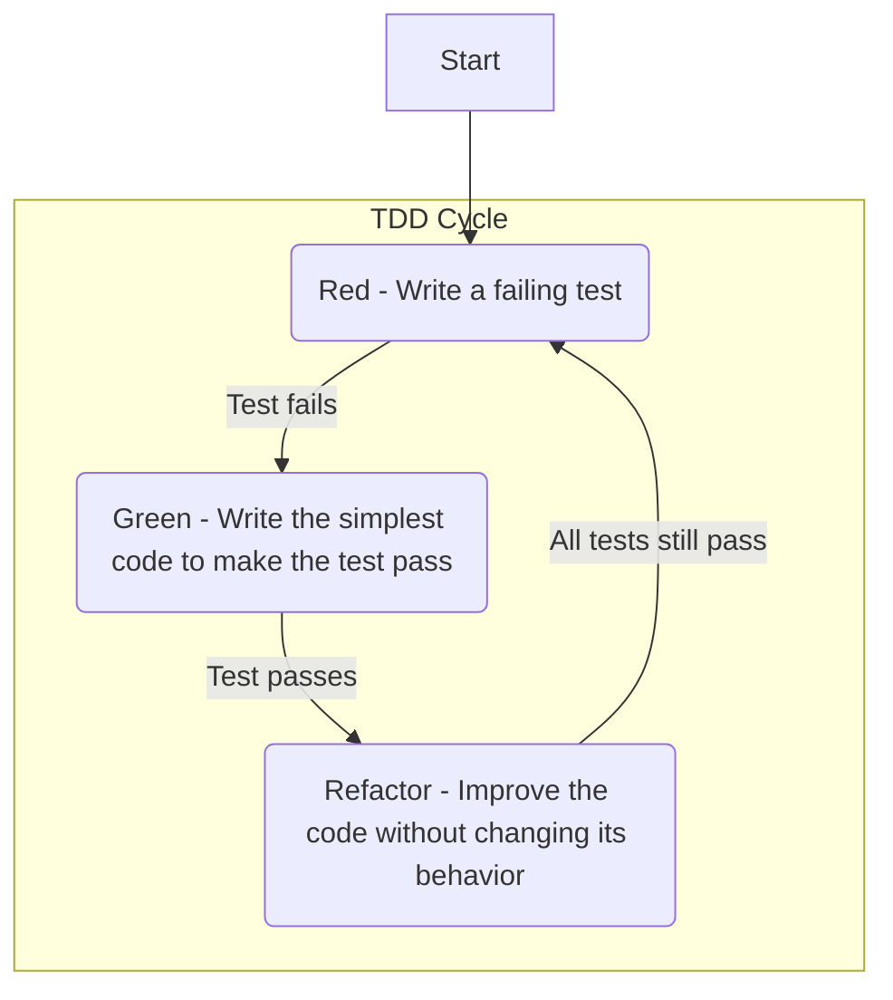

# Test-Driven Development (TDD)

While the canonical name is **Test-Driven Development**, many practitioners argue it should be called **Test-Driven Design**. This distinction is crucial: TDD is a software development process that is less about testing and more about **design**. It reverses the traditional cycle: instead of writing code and then testing it, TDD requires writing a test *before* the production code. Popularized by Kent Beck, TDD is a discipline that forces developers to think about the desired outcome before implementation, leading to simpler, more robust designs.

The fundamental principle is to let tests guide development. This practice is a direct application of the **[[yagni|YAGNI]]** principle: you only write code in response to a failing test that represents a concrete, immediate requirement. This prevents over-engineering and ensures that every line of code has a clear and verifiable purpose.

The process is iterative and follows a short, disciplined cycle known as **"Red-Green-Refactor"**.

---

## The TDD Cycle: Red-Green-Refactor

TDD is defined by a simple yet powerful development cycle. Every new feature or change begins with a test.

1.  **RED - Write a failing test:**
    The developer starts by writing a single [[software-engineering-practices/testing/|automated test]] for a small piece of desired functionality. Since the code doesn't exist yet, the test must fail. This failure is crucial; it confirms the test is working correctly.

2.  **GREEN - Write the code to make the test pass:**
    The goal is to make the test pass as quickly as possible. This step embodies the **[[kiss|KISS]]** principle: write the **minimum amount of code** necessary. At this stage, elegance and optimal design are not the priority. The focus is solely on satisfying the test's requirements.

3.  **REFACTOR - Improve the code:**
    With the safety of a passing test, the developer can now clean up the code. This is the phase where good design practices are applied: removing duplication, improving clarity, and refining the structure. The test suite ensures that this refactoring doesn't introduce regressions.

This tight cycle, repeated many times, ensures that the codebase remains clean, well-tested, and strictly aligned with the project's requirements.

---

## The Benefits of TDD

Adopting TDD brings many benefits that go far beyond simple bug detection.

*   **Safety Net:** This is a consecrated term from the Extreme Programming community. It refers to the comprehensive suite of tests that protects against **regressions** (i.e., breaking existing functionality). This "net" gives developers the confidence to refactor and evolve the architecture without fear.
*   **Better Design & Strong YAGNI Enforcement:** TDD is a powerful design tool. It forces you to think about interfaces first and leads to more [[cohesion-coupling|loosely coupled and highly cohesive]] code. Because code is only written to pass a specific test, the [[yagni|YAGNI]] principle is strictly enforced.
*   **Reduces Bugs:** By design, every piece of logic is tested from its inception. Bugs are caught early, where they are cheapest to fix.
*   **Living Documentation:** The tests serve as precise, executable documentation. They describe exactly how the code is intended to behave.

---

## TDD, BDD, and DDD

TDD has strong relationships with other key design methodologies.

### TDD vs. BDD (Behavior-Driven Development)

[[bdd|Behavior-Driven Development]] is an evolution of TDD that focuses on collaboration between technical and non-technical stakeholders. It uses a more descriptive, business-readable language (like Gherkin's `Given-When-Then`) to define requirements.
*   **BDD** defines the high-level **behavior** from a user's perspective (acceptance tests).
*   **TDD** is then used as the inner loop to implement the code that satisfies that behavior ([[unit-testing|unit tests]]).

### TDD and Domain-Driven Design

TDD and [[ddd|Domain-Driven Design (DDD)]] are highly synergistic. While DDD provides the tools to model a complex business domain (the **what**), TDD provides the discipline to implement that model correctly (the **how**).

*   **Implementing Aggregates:** TDD is the ideal way to build a DDD Aggregate. You can write tests that codify the Aggregate's **invariants** (business rules) before writing the implementation. This ensures the Aggregate protects its own consistency, which is a core tenet of DDD.
*   **Validating the Domain Model:** The TDD cycle ensures that every Entity, Value Object, and Domain Service is built to specification and behaves as expected, reinforcing the integrity of the domain model.

---

## Relationship with Other Patterns and Architectures

TDD integrates naturally with other practices and architectures aimed at producing high-quality software.

*   **[[clean-code|Clean Code]]:** TDD is one of the fundamental practices for writing clean code. The "Refactor" step of the cycle is entirely dedicated to improving code quality, a central principle of Clean Code.
*   **[[clean|Clean Architecture]], [[onion|Onion Architecture]], [[hexagonal|Hexagonal Architecture]]:** These architectures emphasize an independent and testable domain core. TDD is the quintessential technique for building this core. It allows for the development of business logic in isolation, without depending on the user interface, databases, or other infrastructure.
*   **Continuous Integration (CI):** The automated test suite produced by TDD is the backbone of any CI pipeline. Each `commit` can be automatically built and tested, ensuring that the code remains functional at all times.

---

## Resources & links

### Articles

1.  **[CANON TDD](https://tidyfirst.substack.com/p/canon-tdd)**
    An article by Kent Beck, the creator of TDD, in which he clarifies the "canonical" TDD workflow as a five-step cycle designed to safely introduce new behavior while avoiding common pitfalls.

2.  **[Test Driven Development is the best thing that has happened to software design](https://www.thoughtworks.com/insights/blog/test-driven-development-best-thing-has-happened-software-design)**
    This article argues that TDD's primary value is in software design, providing fast feedback and helping to identify and rectify design flaws early, leading to cleaner and more maintainable code.

### Videos

1.  **[Test-Driven Development // Fun TDD Introduction with JavaScript](https://www.youtube.com/watch?v=Jv2uxzhPFl4)**
    A beginner-friendly introduction to the TDD philosophy and workflow, demonstrated with JavaScript and the Jest testing framework.

2.  **[Test Driven Development - What? Why? And How?](https://www.youtube.com/watch?v=llaUBH5oayw)**
    In this video, Dave Farley explains TDD as a powerful design technique rather than just a testing practice, covering the fundamentals of what it is, why it is so effective, and how to get started.
