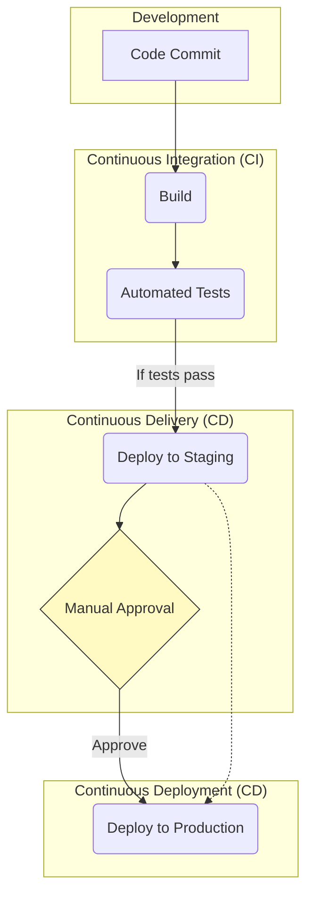

# CI/CD (Continuous Integration & Continuous Delivery/Deployment)

CI/CD is a cornerstone of modern [[devops|DevOps]] practices, representing a method for frequently and reliably delivering applications to customers by introducing automation into the stages of software development. The term combines **Continuous Integration (CI)** with either **Continuous Delivery** or **Continuous Deployment (CD)**.

The primary goal of CI/CD is to solve "integration hell"—the significant problems that arise when development teams work in isolation for long periods and then attempt to merge their changes, leading to complex conflicts and bugs. By automating the build, test, and deployment processes, CI/CD enables teams to release software faster, with higher quality and reduced risk.

---

## The CI/CD Pipeline

The entire automated process is known as a **CI/CD pipeline**. It acts as the backbone of the development workflow, providing a fast feedback loop to developers.

*Description: The CI/CD pipeline automates the path from code commit to deployment. Continuous Integration covers the build and test phases. Continuous Delivery automates deployment to a staging environment, requiring manual approval for production. Continuous Deployment takes it a step further by automating the production release as well.*

---

## Core Components

### Continuous Integration (CI)

CI is the practice where developers frequently merge their code changes into a central repository (e.g., a `main` branch in Git). Each merge triggers an automated workflow that:
1.  **Builds** the application.
2.  Runs a suite of **automated tests** (primarily [[unit-testing|unit]] and [[integration-testing|integration tests]]).

- **Goal**: To detect and fix integration errors early. If a build or test fails, the pipeline stops, and the team is notified immediately. This ensures the codebase is always in a healthy, working state.
- **Prerequisite**: A comprehensive suite of automated tests is essential for CI to be effective.

### Continuous Delivery

Continuous Delivery extends CI by automatically deploying every change that passes the CI stage to a production-like environment (e.g., staging, UAT).

- **Goal**: To ensure that the application is always in a deployable state.
- **Key Feature**: The final deployment to the **production** environment is triggered by a **manual approval**. This keeps humans in control of the business decision of *when* to release to customers, while ensuring the technical release process is fully automated and tested.

### Continuous Deployment

Continuous Deployment is the final evolution of the pipeline. It takes Continuous Delivery a step further by automating the release to production.

- **Goal**: To release new features to users as quickly as possible.
- **Key Feature**: Every change that passes all automated tests is **automatically deployed to production** without any human intervention.
- **Prerequisite**: This requires a very high level of confidence in the automated test suite, robust [[monitoring]], and often advanced deployment strategies like canary releases or blue-green deployments to mitigate risk.

---

## Benefits of CI/CD

- **Faster Release Cycles**: Automation drastically reduces the time from code commit to production deployment.
- **Improved Code Quality**: Early detection of bugs and integration issues leads to a more stable codebase.
- **Reduced Risk**: Deploying small, incremental changes is far less risky than large, infrequent releases.
- **Increased Developer Productivity**: Developers get rapid feedback and can spend more time writing code and less time on manual deployment tasks.

---

## Relationship with Other Concepts

- **[[devops|DevOps]]**: CI/CD is a foundational practice that enables the DevOps culture of collaboration, automation, and continuous feedback loops between development and operations teams.
- **[[testing/|Automated Testing]]**: A reliable CI/CD pipeline is impossible without a strong foundation of automated tests, including [[unit-testing|unit tests]], [[integration-testing|integration tests]], [[functional-testing|functional tests]], and [[end-to-end-testing|end-to-end tests]].
- **[[containerization|Containerization]] ([[docker|Docker]], [[lxc|LXC]])**: Containers provide a consistent and reproducible environment for the application to run in, from the developer's machine all the way through the CI/CD pipeline to production.
- **[[kubernetes|Orchestration (Kubernetes)]]**: Orchestration platforms automate the deployment, scaling, and management of containerized applications, which is a key part of the "deployment" stage of a CD pipeline.
- **[[twelve-factor-app|The Twelve-Factor App]]**: Principles like "V. Build, Release, Run" and "III. Config" are perfectly aligned with and enabled by CI/CD practices.
- **[[infrastructure-as-code|Infrastructure as Code (IaC)]]**: IaC automates the provisioning and management of infrastructure (servers, databases, networks), ensuring that environments are consistent and reproducible across all stages of the CI/CD pipeline.
- **[[monitoring|Monitoring]] & [[observability|Observability]]**: Essential for providing rapid feedback on the health and performance of applications in production, enabling quick detection of issues and supporting automated rollbacks in Continuous Deployment.

---

## Key Tools and Platforms

The CI/CD ecosystem is rich with tools that facilitate automation across the pipeline.

-   [**Jenkins**](https://www.jenkins.io/): An open-source automation server that supports building, deploying, and automating any project. Highly extensible with a vast plugin ecosystem.
-   [**GitLab CI/CD**](https://about.gitlab.com/topics/ci-cd/): A built-in CI/CD solution integrated directly into GitLab, offering seamless integration with source code management.
-   [**GitHub Actions**](https://github.com/features/actions): A flexible automation platform integrated with GitHub repositories, allowing for custom workflows to build, test, and deploy code.
-   [**CircleCI**](https://circleci.com/): A cloud-based CI/CD platform known for its speed, ease of use, and robust integrations.
-   [**Azure DevOps**](https://azure.microsoft.com/en-us/products/devops/): A suite of Microsoft services that includes Azure Pipelines for CI/CD, integrated with Azure cloud services.
-   [**AWS CodePipeline**](https://aws.amazon.com/codepipeline/): A fully managed continuous delivery service that automates release pipelines for fast and reliable application and infrastructure updates.

---

## Resources & links

### Articles

1.  **[What is CI/CD? - Red Hat](https://www.redhat.com/en/topics/devops/what-is-ci-cd)**

    This article from Red Hat provides a clear overview of the CI/CD methodology, explaining how it automates the software development lifecycle to accelerate releases and improve quality. It details the distinct roles of Continuous Integration, Continuous Delivery, and Continuous Deployment.

2.  **[A Primer: Continuous Integration and Continuous Delivery (CI/CD) - The New Stack](https://thenewstack.io/a-primer-continuous-integration-and-continuous-delivery-ci-cd/)**

    This primer from The New Stack frames CI/CD as a fundamental DevOps practice. It explains how Continuous Integration focuses on frequent code merges and automated testing, while Continuous Delivery ensures that code is always in a deployable state, often using strategies like canary or blue-green deployments.

3.  **[What is CI/CD? - GitLab](https://about.gitlab.com/topics/ci-cd/)**

    GitLab's guide defines CI/CD as a practice for automating the software development lifecycle to achieve faster, more reliable releases. It covers the core concepts of Continuous Integration, Delivery, and Deployment, highlighting the benefits of quick feedback loops and reduced manual effort.

4.  **[What is CI/CD? - InfoWorld](https://www.infoworld.com/article/3271126/what-is-cicd-continuous-integration-and-continuous-delivery-explained.html)**

    This InfoWorld article explains CI/CD as a set of agile and DevOps practices for delivering code changes more frequently and reliably. It details the automated pipeline, including the role of continuous testing and Infrastructure as Code (IaC), and discusses the business benefits of faster time-to-market.
