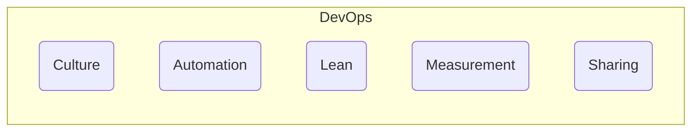

# DevOps

DevOps is a **culture**, a **mindset**, and a **set of practices** that combines software development (Dev) and IT operations (Ops). Its primary goal is to shorten the systems development life cycle and provide continuous delivery with high software quality by breaking down silos between development, operations, and other business teams.

It is not a specific role, a team, or a tool, but rather a philosophy that emphasizes collaboration, automation, and communication to build better software faster and more reliably.

---

## The "CALMS" Framework

A widely accepted, non-controversial framework for describing the pillars of DevOps is the **CALMS** model.

-   **C - Culture**: This is the most critical pillar. It represents the shift from siloed teams to a culture of shared responsibility, collaboration, and empathy. Developers and operations teams work together towards a common goal, sharing ownership of the entire application lifecycle.
-   **A - Automation**: DevOps relies heavily on automating repetitive and error-prone tasks. This includes automating the build, testing, and deployment processes through a [[ci-cd|CI/CD]] pipeline, as well as automating infrastructure provisioning with [[iac|Infrastructure as Code]].
-   **L - Lean**: Applying principles from lean manufacturing to software development. This involves focusing on delivering value to the customer, eliminating waste (e.g., unnecessary features, manual handoffs), and continuously improving the process.
-   **M - Measurement**: Using data and metrics to drive decisions. This involves implementing robust [[monitoring]] and [[software-architecture/observability/|observability]] to track system performance, application health, and user behavior, creating a tight feedback loop for improvement.
-   **S - Sharing**: Fostering an environment where knowledge, tools, and responsibilities are shared across teams. This includes sharing code, best practices, and insights from monitoring and incidents.

---

## Core Practices of DevOps

-   **[[ci-cd|Continuous Integration & Continuous Delivery (CI/CD)]]**: The engine of DevOps automation. CI ensures that code from multiple developers is integrated and tested frequently, while CD automates the release process, making deployments fast and reliable.
-   **[[iac|Infrastructure as Code (IaC)]]**: Managing and provisioning infrastructure (servers, networks, databases) through machine-readable definition files (e.g., Terraform, CloudFormation), rather than manual configuration. This makes infrastructure reproducible, versionable, and scalable.
-   **[[monitoring|Monitoring]] & [[software-architecture/observability/|observability]]**: Implementing comprehensive monitoring to track system health and performance, and building systems that are observable to allow for deep, exploratory analysis when issues arise.
-   **[[software-engineering-practices/testing/|Automated Testing]]**: A robust suite of automated tests ([[unit-testing]], [[integration-testing]], [[end-to-end-testing]]) is a prerequisite for a reliable CI/CD pipeline and for having the confidence to deploy frequently.
-   **[[containerization|Containerization]] & [[kubernetes|Orchestration]]**: Technologies like [[docker|Docker]] and [[kubernetes|Kubernetes]] provide consistent, immutable environments for applications, simplifying deployment and scaling, which are key enablers of DevOps practices.

---

## DevOps vs. Agile

DevOps and Agile are complementary, not competing, methodologies. They work together to improve the software development lifecycle.

-   **Agile** focuses on the **development process**. It provides a framework (like Scrum or Kanban) for managing work in iterative cycles, adapting to changing requirements, and delivering working software frequently.
-   **DevOps** extends Agile principles **beyond development**. It takes the software produced by an Agile team and automates the path to delivering and operating it in production, creating a seamless flow from idea to end-user.

In short, Agile helps teams build the right thing, while DevOps helps them release it quickly and reliably.

---

## Resources & links

### Articles

1.  **[What is DevOps? - Atlassian](https://www.atlassian.com/devops)**

    Atlassian defines DevOps as a set of practices that combines software development and IT operations to shorten the development life cycle and provide continuous delivery. This guide emphasizes the cultural shift, the importance of automation, and how tools like Jira and Bitbucket support the DevOps workflow.

2.  **[What is DevOps? - Red Hat](https://www.redhat.com/en/topics/devops)**

    This article from Red Hat explains DevOps as an approach to culture, automation, and platform design that aims to deliver business value faster and more reliably. It highlights the role of open-source technologies like Kubernetes and Ansible in building a foundation for DevOps practices.

3.  **[What is DevOps? - AWS](https://aws.amazon.com/devops/what-is-devops/)**

    Amazon Web Services describes DevOps as a combination of cultural philosophies, practices, and tools that increases an organization's ability to deliver applications and services at high velocity. The article details key practices like CI/CD, Infrastructure as Code, and monitoring, and shows how AWS services can be used to implement them.
