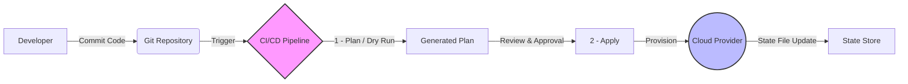

# Infrastructure as Code (IaC)

Infrastructure as Code (IaC) is the practice of managing and provisioning infrastructure through machine-readable definition files, rather than physical hardware configuration or interactive configuration tools. It applies software engineering practices to infrastructure management, enabling consistency, scalability, and reliability.

## Core Principles

### 1. Declarative vs. Imperative
*   **Declarative (What)**: You define the *desired state* of the system, and the tool figures out how to achieve it. This is the preferred approach for modern IaC.
    *   *Example*: "I want 3 AWS EC2 instances of type t3.micro."
    *   *Tools*: [Terraform](https://www.terraform.io/), [Kubernetes](https://kubernetes.io/) manifests, [CloudFormation](https://aws.amazon.com/cloudformation/).
*   **Imperative (How)**: You define the *steps* to achieve the state.
    *   *Example*: "Run this script: check if instance exists, if not create one, then loop 2 more times."
    *   *Tools*: Bash scripts, older configuration management tools (in some modes).

### 2. Idempotency
An operation is **idempotent** if it can be applied multiple times without changing the result beyond the initial application. In IaC, running the same configuration script 100 times should result in the same infrastructure state as running it once.

### 3. Immutability (Immutable Infrastructure)
Instead of modifying existing servers (mutable), you replace them with new ones. If a configuration change is needed, you build a new image, provision new servers, and decommission the old ones. This eliminates two major issues:

*   **Configuration Drift**: The phenomenon where servers in an environment gradually become different from each other and from the documented configuration due to manual ad-hoc changes and updates over time.
*   **Snowflake Servers**: Servers that are unique and difficult to reproduce because they have been manually configured and tweaked so much that their exact state is unknown and cannot be automatically recreated.

### 4. Version Control (Single Source of Truth)
All infrastructure definitions are stored in a Version Control System (VCS) like Git. This enables:
*   **Audit Trails**: Who changed what and when.
*   **Rollbacks**: Reverting to a previous known good state.
*   **Collaboration**: Pull Requests and Code Reviews for infrastructure changes.

## The IaC Lifecycle

The lifecycle of IaC generally follows a pipeline approach, often integrated into CI/CD.



1.  **Code**: Developers write infrastructure definitions (HCL, YAML, Python).
2.  **Plan**: The tool compares the code with the current real-world state and generates a "plan" of changes (add, modify, destroy).
3.  **Apply**: The tool executes the plan to reach the desired state.
4.  **Drift Detection**: Continuous monitoring to ensure the real world hasn't drifted from the code.

## Key Patterns

### GitOps
**GitOps** is an operational framework that takes DevOps best practices used for application development (version control, collaboration, compliance, and CI/CD) and applies them to infrastructure automation.
*   **Git is the single source of truth.**
*   **Operations are performed via Pull Requests.**
*   **Software agents ensure the live state matches the Git state.** (e.g., [ArgoCD](https://argo-cd.readthedocs.io/) for [Kubernetes](https://kubernetes.io/)).

### Environment Parity
IaC allows you to use the exact same code to provision Development, Staging, and Production environments, ensuring they are identical (except for scale, e.g., instance sizes). This reduces "it works on my machine" issues.

## Technology Landscape & Examples

### 1. Provisioning Tools ([Terraform](https://www.terraform.io/), [OpenTofu](https://opentofu.org/))
Focus on creating the infrastructure (VPC, Load Balancers, Databases).

**Example: [Terraform](https://www.terraform.io/) (HCL)**
```hcl
resource "aws_s3_bucket" "data_lake" {
  bucket = "my-corporate-data-lake"
  
  tags = {
    Environment = "Production"
    Owner       = "DataTeam"
  }
}

resource "aws_s3_bucket_public_access_block" "block_public" {
  bucket = aws_s3_bucket.data_lake.id

  block_public_acls       = true
  block_public_policy     = true
}
```

### 2. Configuration Management ([Ansible](https://www.ansible.com/), [Chef](https://www.chef.io/), [Puppet](https://www.puppet.com/), [Salt](https://saltproject.io/))
Focus on configuring the servers (installing software, editing config files). *Note: With immutable infrastructure/containers, this layer is often replaced by Dockerfiles.*

**Example: [Ansible](https://www.ansible.com/) (YAML)**
```yaml
- name: Ensure Nginx is installed
  hosts: webservers
  become: yes
  tasks:
    - name: Install Nginx
      apt:
        name: nginx
        state: present
    
    - name: Start Nginx service
      service:
        name: nginx
        state: started
        enabled: yes
```

### 3. General Purpose Languages ([Pulumi](https://www.pulumi.com/), [CDK](https://aws.amazon.com/cdk/))
Using standard programming languages (TypeScript, Python, Go) to define infrastructure. This brings the full power of IDEs, loops, and abstraction.

**Example: [Pulumi](https://www.pulumi.com/) (Python)**
```python
import pulumi
import pulumi_aws as aws

# Create an AWS resource (S3 Bucket)
bucket = aws.s3.Bucket('my-bucket')

# Export the name of the bucket
pulumi.export('bucket_name', bucket.id)
```

### 4. Kubernetes Package Management ([Helm](https://helm.sh/))
**Helm** helps you manage Kubernetes applications. Helm Charts help you define, install, and upgrade even the most complex Kubernetes application.

**Example: Helm (YAML)**
```yaml
# values.yaml (Configuration)
replicaCount: 2
image:
  repository: nginx
  tag: "1.16.0"

# templates/deployment.yaml (The Template)
apiVersion: apps/v1
kind: Deployment
metadata:
  name: {{ .Release.Name }}-nginx
spec:
  replicas: {{ .Values.replicaCount }}
  template:
    spec:
      containers:
        - name: nginx
          image: "{{ .Values.image.repository }}:{{ .Values.image.tag }}"
```

## Related Concepts

*   [[cloud-native-principles|Cloud Native Principles]]: IaC is a pillar of cloud-native design.
*   [[docker|Docker]]: Containers are often the deployment unit managed by IaC.
*   [[software-architecture/observability/index|Observability]]: Essential for monitoring the health of infrastructure provisioned by IaC.
*   [[reliability-engineering|Reliability Engineering]]: IaC enables rapid recovery and reliable deployments.

---

## Resources & Links

### Articles

1.  **[What is Infrastructure as Code (IaC)? - GitHub](https://github.com/resources/articles/what-is-infrastructure-as-code)**
    This article explains how IaC automates and standardizes infrastructure management using code. It covers the benefits of version control, testing, and CI/CD integration, while also addressing challenges like the learning curve and security risks.

2.  **[What Is Infrastructure as Code (IaC)? - IBM](https://www.ibm.com/think/topics/infrastructure-as-code)**
    A comprehensive guide defining IaC as a DevOps practice. It details the core workflow (write, version, provision, deploy), compares declarative vs. imperative approaches, and explains the concept of immutable infrastructure.

3.  **[What is Infrastructure as Code (IaC)? - Red Hat](https://www.redhat.com/en/topics/automation/what-is-infrastructure-as-code-iac)**
    Red Hat's overview emphasizes the shift from manual processes to code-based provisioning. It highlights the advantages of consistency and scalability in modern cloud environments and discusses the role of automation tools.

### Videos

1.  **[What is Infrastructure as Code? - IBM Technology](https://www.youtube.com/watch?v=zWw2wuiKd5o)**
    A visual explanation of IaC concepts, illustrating how it enables rapid, consistent, and scalable infrastructure deployment compared to traditional manual methods.

2.  **[Infrastructure as Code Explained - TechWorld with Nana](https://www.youtube.com/watch?v=POPP2WTJ8es)**
    This video breaks down the differences between popular IaC tools like Terraform, Ansible, and Puppet. It explains key concepts such as procedural vs. declarative, mutable vs. immutable infrastructure, and agent vs. agentless architectures.
