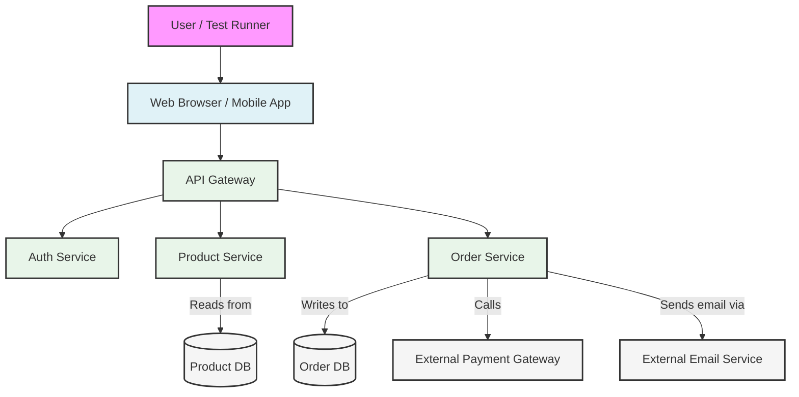

# End-to-End Testing

**End-to-End (E2E) Testing** is a testing methodology used to validate an entire software application from start to finish, simulating a complete user workflow. It sits at the very top of the [[software-engineering-practices/testing/|Testing Pyramid]], representing the highest level of integration and functional verification.

The goal of E2E testing is to ensure that all integrated components of a system, including its user interface, backend services, databases, and external dependencies, work together harmoniously in a production-like environment. It answers the question: "Does the application behave as expected from the user's perspective in a real-world scenario?"

---

## Scope of End-to-End Testing

Unlike [[unit-testing|unit tests]] or [[integration-testing|integration tests]] that focus on smaller parts of the system, E2E tests cover a complete user journey.

**Example User Journey for an E-commerce Site:**
1.  A user opens the website.
2.  They search for a product.
3.  They add the product to their shopping cart.
4.  They proceed to checkout.
5.  They enter their shipping and payment information.
6.  They confirm the purchase.
7.  They receive an order confirmation email.

An E2E test would automate this entire sequence, interacting with the UI and verifying the state of the system at each step (e.g., checking the database for the new order, verifying the call to the payment gateway).

*Description: An End-to-End test simulates a real user's actions, flowing through the entire system stack—from the UI, through various microservices and databases, to external third-party services.*

---

## Pros and Cons of End-to-End Testing

### Pros
- **High Confidence**: A passing E2E test suite provides a high degree of confidence that the application is working correctly from the user's perspective.
- **Broad Coverage**: It tests the integration of all parts of the system, catching bugs that other test types cannot.
- **Verifies Real Workflows**: It ensures that critical user journeys are functional, which is directly tied to business value.

### Cons
- **Slow**: E2E tests are notoriously slow to run because they involve spinning up the entire application stack, interacting with a browser, and making real network calls.
- **Brittle and Flaky**: They are prone to breaking due to minor UI changes, network latency, or issues in the test environment. A test that fails intermittently without any code changes is known as a "flaky" test.
- **Difficult to Debug**: When an E2E test fails, it can be difficult to pinpoint the exact cause of the failure, as it could be in the frontend, a backend service, a dependency, or the test script itself.
- **Expensive**: They are costly to write, maintain, and run, which is why the Testing Pyramid advises having far fewer of them compared to unit and integration tests.

---

## Best Practices for E2E Testing

- **Prioritize Critical Paths**: Focus E2E tests on the most critical "happy path" user journeys that are essential for the business.
- **Isolate Test Environments**: Run E2E tests in a dedicated, stable, and production-like environment to minimize flakiness.
- **Use a Test Data Strategy**: Have a reliable way to seed and clean up test data to ensure tests are repeatable.
- **Don't Overuse Them**: Rely on [[unit-testing|unit]] and [[integration-testing|integration]] tests for detailed logic and error-case testing. Use E2E tests for broad workflow validation, not for testing every edge case.

---

## Key Activities in E2E Testing

A successful E2E testing strategy involves several distinct activities:

1.  **Test Planning**: This initial phase involves defining the scope of testing. The team identifies the critical user journeys, workflows, and scenarios that need to be validated. It also includes selecting the right tools and setting up the test environment.

2.  **Test Design**: In this phase, detailed test cases are created for the selected user journeys. This includes writing test scripts, defining test data requirements, and outlining the expected outcomes for each step in the workflow.

3.  **Test Execution**: The designed test cases are executed on the application. This is often automated and integrated into a [[ci-cd|CI/CD pipeline]] to provide continuous feedback. Tests can be run in parallel to speed up the execution time.

4.  **Results Analysis and Reporting**: After execution, the results are analyzed. Failures are investigated to distinguish between actual application bugs, test script errors, or environment issues. A detailed report is generated to provide stakeholders with a clear overview of the application's quality.

---

## Common Tools and Frameworks

While many tools can be used for E2E testing, some of the most prominent in modern web development include:

- **[Selenium](https://www.selenium.dev)**: The long-standing standard for browser automation. It supports a vast array of browsers and has bindings for numerous programming languages (Java, C#, Python, etc.). It is highly flexible but can be complex to set up.

- **[Cypress](https://www.cypress.io)**: A modern, all-in-one testing framework that runs directly in the browser. It is known for its developer-friendly experience, fast feedback loop, and excellent debugging capabilities. It is JavaScript-based and primarily targets web applications.

- **[Playwright](https://playwright.dev)**: A newer framework from Microsoft that has quickly gained popularity. It provides a single API to automate Chromium, Firefox, and WebKit. It is known for its speed, reliability, and powerful features like network interception and multi-page emulation.

- **[Appium](https://appium.io)**: The de-facto standard for mobile E2E testing. It allows you to write tests against iOS and Android apps using the same WebDriver API as Selenium.

---

## Resources & Links

### Articles

1.  **[What is E2E? A guide to end-to-end testing](https://circleci.com/blog/what-is-end-to-end-testing/)**
    This article from CircleCI provides a solid introduction to end-to-end testing. It explains what E2E testing is, why it's important, and how it fits into the broader testing landscape. It also covers the pros and cons of E2E testing and provides a list of popular E2E testing frameworks.

2.  **[End-to-End Testing in 2025: Complete Beginner's Guide](https://www.bunnyshell.com/blog/introduction-to-end-to-end-testing-everything-you-/)**
    This comprehensive guide by Bunnyshell covers everything you need to know about end-to-end testing. It defines E2E testing, explains its benefits, and discusses its role in Agile development and CI/CD. The article also provides a detailed overview of popular E2E testing tools and frameworks.

3.  **[E2E Testing - Engineering Fundamentals Playbook](https://microsoft.github.io/code-with-engineering-playbook/automated-testing/e2e-testing/)**
    Microsoft's Engineering Playbook offers a concise and practical guide to E2E testing. It outlines the purpose of E2E tests, their advantages and disadvantages, and best practices for implementing them. The playbook also lists several popular E2E testing frameworks.
