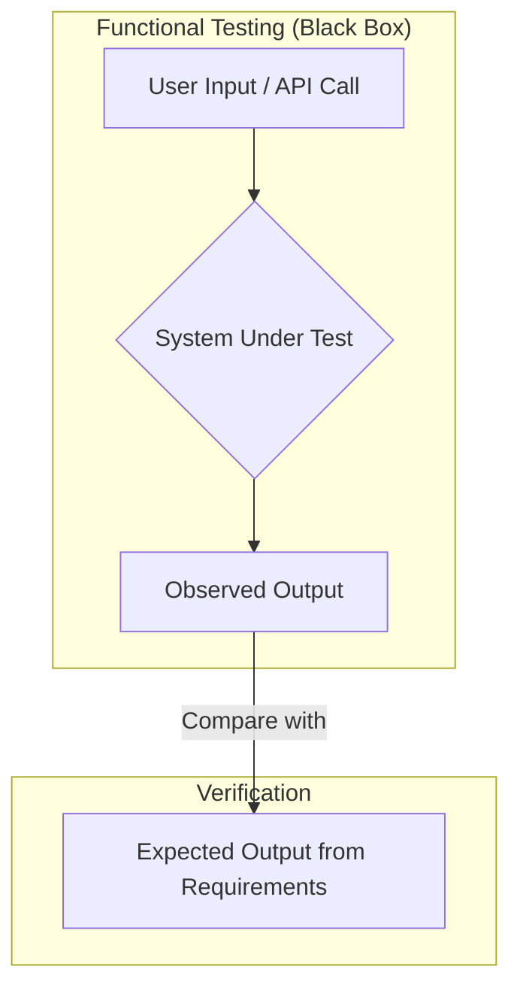

# Functional Testing

**Functional Testing** is a type of software testing that validates a software system against its functional requirements and specifications. The core purpose is to verify **what** the system does, ensuring that each function of the software operates in conformance with its specified behavior.

Functional testing is a form of **black-box testing**, where the tester does not need to know the internal implementation of the software. The focus is purely on the inputs and the expected outputs, treating the system as a "black box."

---

## Characteristics of Functional Testing

- **Requirements-Based**: Tests are designed based on the functional specifications of the software. For example, "When a user enters a valid username and password, they should be redirected to the dashboard."
- **Black-Box Perspective**: Testers are concerned with the user interface (e.g., buttons, text fields, APIs) and not the source code that implements the functionality.
- **Business-Oriented**: It directly answers the question, "Does the software meet the business needs?"
- **Contrasted with Non-Functional Testing**: It is distinct from non-functional testing, which evaluates characteristics like performance, reliability, security, and usability (i.e., *how* the system works, not *what* it does).

*Description: In functional testing, the tester provides an input and observes the output, comparing it against the expected result defined in the requirements, without any knowledge of the system's internal workings.*

---

## Relationship with Other Test Types

Functional testing is a broad category, and other test types can be considered "functional" in nature. The key is the *intent* of the test.

- **[[unit-testing|Unit Testing]]**: Can be functional. A unit test that checks if an `add(2, 3)` function returns `5` is testing the functional requirement of that specific unit.
- **[[integration-testing|Integration Testing]]**: Is often functional. An integration test that verifies that calling the `/users` API endpoint returns a list of users is testing a functional requirement of that integration point.
- **[[end-to-end-testing|End-to-End Testing]]**: Is almost always functional. An E2E test that simulates a user logging in, adding an item to a cart, and checking out is a comprehensive functional test of a business workflow.

The term "Functional Test" is often used to describe a dedicated testing phase, typically performed by a Quality Assurance (QA) team, that focuses on the business requirements from a user's perspective. This is a key part of the acceptance testing process.

---

## Types of Functional Testing

Functional testing includes several specific techniques and types:

- **Smoke Testing**: A preliminary check to ensure the most crucial functions of a program work, used to decide if a build is stable enough for further testing.
- **Sanity Testing**: A quick check to ensure that a small change or bug fix has not introduced any new issues in the core functionality.
- **Regression Testing**: The process of re-running tests to ensure that previously developed and tested software still performs correctly after a change.
- **User Acceptance Testing (UAT)**: The final phase of testing where actual users test the software to see if it meets their business needs in a real-world scenario.

These testing activities are essential for ensuring that the software delivered to the end-user is correct, reliable, and fit for purpose.

---

## Pros and Cons of Functional Testing

### Pros
- **Focus on User Experience**: It ensures the software is usable and meets the end-user's expectations, as it simulates actual system usage.
- **Improves Quality**: It is highly effective at finding bugs in application functionality, logic, and business workflows.
- **No Internal Knowledge Needed**: Since it's a black-box method, testers do not need to understand the source code or internal architecture.
- **Clear Requirements Verification**: It provides a clear way to verify that the software adheres to the specified requirements.

### Cons
- **Potential for Redundancy**: Without a good test plan, there is a risk of performing redundant tests or missing some logical paths.
- **Can Be Time-Consuming**: Testing all functions of a complex system can be a lengthy process.
- **Ignores Internal Structure**: It cannot detect issues within the code that do not manifest as a functional bug, such as performance bottlenecks or security vulnerabilities.
- **Depends on Good Requirements**: The effectiveness of functional testing is directly tied to the quality and completeness of the functional requirements documentation. Ambiguous requirements lead to ambiguous tests.

---

## Functional Testing Techniques

To design effective functional tests, especially for inputs, testers use several black-box techniques to select test cases intelligently.

### Equivalence Partitioning

This technique involves dividing input data into partitions or "equivalence classes" of data from which test cases can be derived. The assumption is that if one test case in a partition reveals a bug, all other test cases in the same partition will likely reveal the same bug.

- **Example**: If a text field accepts integers from 1 to 100, the equivalence classes would be:
    - Valid: Any integer between 1 and 100 (e.g., 50).
    - Invalid: Any integer less than 1 (e.g., 0).
    - Invalid: Any integer greater than 100 (e.g., 101).
    - Invalid: Non-integer values (e.g., "abc").

### Boundary Value Analysis (BVA)

This technique focuses on testing the "boundaries" between partitions. Experience shows that errors often occur at the edges of the input domain.

- **Example**: For the same field accepting integers from 1 to 100, the boundary values would be:
    - Lower Boundary: 0 (invalid), 1 (valid), 2 (valid).
    - Upper Boundary: 99 (valid), 100 (valid), 101 (invalid).

By combining these techniques, testers can create a concise yet powerful set of test cases that cover the input domain effectively without testing every possible value.

---

## Resources & links

### Articles

1.  **[Functional Testing - Software Testing - GeeksforGeeks](https://www.geeksforgeeks.org/software-testing/software-testing-functional-testing/)**
    This GeeksforGeeks article offers a clear, structured overview of functional testing. It defines the concept, explains its importance in delivering a quality product, and details the steps involved in the functional testing process. The article also provides a comprehensive list of functional testing types, from unit and integration testing to user acceptance testing.

2.  **[What Is Functional Testing? (Intermediate Guide) - PractiTest](https://www.practitest.com/resource-center/article/what-is-functional-testing/)**
    PractiTest provides an intermediate-level guide that defines functional testing as a method for verifying what a system does, without considering how it does it. The article emphasizes its black-box nature and distinguishes it from non-functional testing. It also explores various functional testing techniques like equivalence partitioning and boundary value analysis.

3.  **[Functional vs non-functional software testing | CircleCI](https://circleci.com/blog/functional-vs-non-functional-testing/)**
    This CircleCI blog post offers a concise and clear comparison between functional and non-functional testing. It explains that functional testing validates the actions a system should perform, while non-functional testing assesses the system's performance and user experience. The article highlights that both are essential for building a comprehensive testing strategy.
