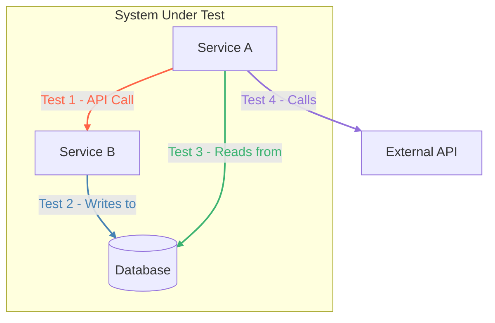

# Integration Testing

**Integration Testing** is a level in software testing where individual software modules are combined and tested as a group. It follows [[unit-testing|Unit Testing]] and precedes [[end-to-end-testing|End-to-End Testing]] in the [[software-engineering-practices/testing/|Testing Pyramid]]. The primary purpose of integration testing is to expose faults in the interaction between integrated units.

While [[unit-testing|unit tests]] ensure that each component works correctly in isolation, integration tests verify that these components communicate and cooperate as intended. They are crucial for finding issues related to data flow, communication protocols, and interactions with external systems.

---

## What Does Integration Testing Verify?

Integration tests focus on the "seams" between components. Common areas for testing include:
- **API Calls**: Ensuring one [[microservices|microservice]] can correctly call another, send the right data, and handle the response. This is a core part of [[api-testing|API testing]].
- **Database Interactions**: Verifying that the application can correctly read from and write to a database, and that the [[data-integrity|data integrity]] is maintained.
- **Third-Party Services**: Checking the interaction with external services, like payment gateways or authentication providers.
- **Message Queues**: Ensuring that services can correctly publish and subscribe to messages on a [[message-queue|message queue]].

*Description: An integration test verifies the communication paths between different components. In this diagram, each numbered and colored link corresponds to a specific integration test that validates that particular interaction.*

---

## Approaches to Integration Testing

There are several strategies for performing integration testing, each with its own trade-offs.

### 1. Big Bang Approach
In this approach, all or most of the modules are coupled together and tested at once.
- **Pros**: Simple to conceptualize.
- **Cons**: Extremely difficult to debug. If a test fails, it's hard to pinpoint which interface is causing the issue. It's generally considered an anti-pattern for complex systems.

### 2. Incremental Approach
Modules are integrated and tested one by one in a planned sequence. This makes it much easier to locate defects. The different strategies use [[test-doubles|Test Doubles]] like **Stubs** and **Drivers** to simulate missing modules.

- **Top-Down**: Testing proceeds from the highest-level modules down to the lower-level ones. Lower-level modules are often simulated by **[[test-doubles|Stubs]]**.
- **Bottom-Up**: Testing starts with the lowest-level modules and moves upwards. Higher-level modules that are not yet developed are simulated by **[[test-doubles|Drivers]]**.
- **Sandwich (Hybrid)**: A combination of top-down and bottom-up approaches, testing the middle layer first and then proceeding in both directions.

### Types of Integration: CIT vs. SIT

Integration testing can be broadly categorized based on its scope:

-   **Component Integration Testing (CIT)**: Focuses on the interactions between components *within a single application*. For example, testing the interaction between a service layer and a data access layer in a monolithic application.
-   **System Integration Testing (SIT)**: Focuses on the interactions *between different systems or [[microservices|microservices]]*. This type of testing is crucial in distributed architectures to verify that separate applications can communicate correctly over the network.

### Using Test Doubles

In modern testing, a variety of [[test-doubles|Test Doubles]] are used to isolate components and manage dependencies. While the incremental approach traditionally relies on Stubs and Drivers, other doubles like **Mocks**, **Fakes**, and **Spies** are essential for handling external dependencies, such as third-party APIs or databases.

For a complete definition of each type, see the [[test-doubles|Test Doubles]] page.

---

## Modern Integration Testing Patterns

### Test Environment Management

One of the biggest challenges of integration testing is setting up and managing the required dependencies. Modern tools have made this significantly easier.

**Testcontainers** is a popular library (available for Java, .NET, Go, and others) that allows you to programmatically define and launch Docker [[containerization|containers]] for your tests. This means you can spin up a real database (like PostgreSQL), a message broker (like RabbitMQ), or any other dependency, run your tests against it, and then tear it down automatically. This provides a high-fidelity test environment that is fully automated and ephemeral.

### Contract Testing

In a [[microservices|microservices]] architecture, running integration tests for every interaction can be slow and brittle. **Contract Testing** offers a lightweight alternative. It is a technique to ensure that two services (a "consumer" and a "provider") can communicate with each other without running a full integration test.

1.  The **Consumer** defines a "contract" specifying the requests it will send and the responses it expects.
2.  This contract is used to generate a mock provider for the consumer's tests.
3.  The same contract is then used to verify that the **Provider** actually meets the expectations defined in it.

If both sides adhere to the contract, you can be confident that they are compatible. Popular tools for contract testing include **Pact** and **Spring Cloud Contract**.

---

## Challenges in Integration Testing

- **Complexity**: Managing the test environment with multiple running services, databases, and other dependencies can be complex.
- **Data Management**: Tests often require a specific state in the database, which must be set up before the test and cleaned up afterward.
- **Slow Execution**: Compared to unit tests, integration tests are significantly slower because they involve network communication, database I/O, and file system operations.
- **Third-Party Systems**: When testing integrations with external services, you may need to use mocks or sandboxed environments to avoid making real calls, which could be costly or unreliable.

---

## Resources & links

### Articles

1.  **[Integration Testing Strategies - GeeksforGeeks](https://www.geeksforgeeks.org/software-testing/software-engineering-integration-testing/)**
    A detailed guide that defines integration testing and its importance. It covers the entire process, from identifying components to evaluating results, and provides a thorough explanation of the four main strategies: Big-Bang, Bottom-Up, Top-Down, and Mixed/Sandwich.

2.  **[Modern Integration Testing - Medium](https://medium.com/@iamprovidence/integration-tests-9c71f5cc5fcd)**
    This article provides a deep dive into modern integration testing strategies, focusing on how to effectively mock dependencies. It categorizes dependencies (in-process, out-of-process) and recommends specific .NET tools like Testcontainers, Respawn, and WireMock for managing complex test environments.

3.  **[Unit vs. Integration Testing - Codefresh](https://codefresh.io/learn/unit-testing/unit-testing-vs-integration-testing-5-key-differences-and-why-you-need-both/)**
    A clear comparison between unit and integration testing, highlighting five key differences: granularity, focus, complexity, dependencies, and speed. The article emphasizes why both are essential for a comprehensive testing strategy and how they complement each other.

### Videos

1.  **[Integration Testing Tutorial (Video)](https://www.youtube.com/watch?v=QYCaaNz8emY)**
    A beginner-friendly video tutorial that explains the core concepts of integration testing. It covers the roles of Stubs and Drivers and visually explains the different strategic approaches, including Big Bang, Top-Down, and Bottom-Up.

2.  **[Unit and Integration Testing Compared (Video) - Jelvix](https://www.youtube.com/watch?v=pf6Zhm-PDfQ)**
    A concise video that visually compares unit testing and integration testing. It clarifies the scope of each, explaining that unit tests focus on isolated components while integration tests verify that those components work together as a group.
