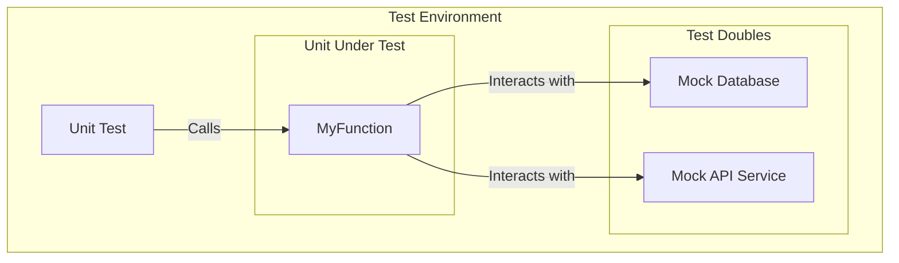

# Unit Testing

**Unit Testing** is a software testing method where individual units or components of a software are tested in isolation. The primary goal is to validate that each unit of the software performs as designed. A "unit" is the smallest testable part of any software, which could be a function, a method, a procedure, or an object.

Unit tests form the foundation of the [[software-engineering-practices/testing/|Testing Pyramid]]. Because they test components in isolation and do not rely on external dependencies like databases or network services, they are extremely fast to execute, providing developers with near-instant feedback.

---

## The Principle of Isolation

The key principle of unit testing is **isolation**. To achieve this, any external dependencies that a unit interacts with are replaced by **[[test-doubles|Test Doubles]]**, such as mocks, stubs, or fakes.

- **Why Isolate?** Isolation ensures that a test fails only if there is a bug in the unit being tested, not because of a problem in a dependency. This makes debugging straightforward and the test results reliable.
- **Test Doubles**: The most common types of test doubles used in unit testing are **Mocks**, **Stubs**, **Fakes**, and **Spies**. For a complete definition of each type, see the [[test-doubles|Test Doubles]] page.


*Description: The Unit Test directly invokes `MyFunction`. `MyFunction`'s dependencies on a real database and API are replaced with mocks, ensuring it is tested in complete isolation.*

---

## Benefits of Unit Testing

- **Early Bug Detection**: Since unit tests are written by developers during the coding phase, they help catch bugs early in the development lifecycle, when they are cheapest to fix.
- **Improved Code Quality & Design**: Writing testable code often forces developers to design smaller, more focused, and decoupled components, leading to better software architecture. This is a core tenet of [[tdd|Test-Driven Development (TDD)]].
- **Safety Net for Refactoring**: A comprehensive suite of unit tests acts as a safety net, allowing developers to refactor and improve the codebase with confidence, knowing that any breaking changes will be caught immediately.
- **Living Documentation**: Unit tests serve as a form of executable documentation, demonstrating how a particular unit of code is intended to be used.

---

### Test Structure: The Arrange-Act-Assert (AAA) Pattern

To ensure clarity and consistency, unit tests often follow a simple structure known as Arrange-Act-Assert:

1.  **Arrange**: Set up the test. This involves initializing objects, preparing data, and configuring mocks or stubs.
2.  **Act**: Execute the unit of code being tested. This is typically a single method call.
3.  **Assert**: Verify the outcome. Check that the result (e.g., a return value, a change in state, or an interaction with a mock) is what you expected.

This pattern makes tests easy to read by clearly separating the setup, execution, and verification steps.

### Properties of Good Unit Tests: FIRST

The acronym FIRST describes a set of key principles for writing high-quality unit tests:

-   **F (Fast)**: Tests should run quickly so developers can run them frequently without breaking their workflow.
-   **I (Isolated/Independent)**: Tests should not depend on each other or any external state (like a database or network). Each test should be able to be run on its own.
-   **R (Repeatable)**: A test should produce the same result every time it is run, regardless of the environment.
-   **S (Self-Validating)**: The test should automatically determine if it passed or failed. It should not require manual inspection of a log file or console output.
-   **T (Timely/Thorough)**: "Timely" means tests should be written at the right time—ideally, just before the production code they test (as in [[tdd|TDD]]). "Thorough" means they should cover all important execution paths.

### Code Coverage

Code coverage is a metric that measures the percentage of your codebase that is executed by your automated tests. It is often used as an indicator of test suite quality.

-   **Types of Coverage**: Common metrics include line coverage (how many lines of code were run) and branch coverage (how many `if`/`else` or other control structure branches were taken).
-   **Usefulness and Limitations**: While high code coverage (e.g., >80%) is often a good goal, it is not a guarantee of quality. It's possible to have high coverage with poor tests that don't actually verify behavior correctly. It is best used as a tool to identify untested parts of the application rather than as a primary measure of success.

### Common Pitfalls

When writing unit tests, it's important to avoid common anti-patterns:

-   **Testing Implementation Details**: Tests should focus on a unit's public API and its behavior, not its internal implementation. Tying tests to implementation details makes them brittle and difficult to refactor.
-   **Overly Complex Tests**: A single unit test should ideally test one specific thing. If a test is too long or has multiple "Act" and "Assert" steps, it should be broken into smaller, more focused tests.
-   **Ignoring Edge Cases**: Good tests cover not only the "happy path" but also edge cases, error conditions, and boundary values.
-   **Inter-dependent Tests**: Tests that rely on a specific execution order or share state are fragile and violate the "Isolated" principle of FIRST.

---

## Unit Testing vs. Other Test Types

- **vs. [[integration-testing|Integration Testing]]**: Unit tests check components in isolation, while integration tests verify that multiple components work together correctly.
- **vs. [[functional-testing|Functional Testing]]**: A unit test is a "white-box" test (the developer knows the internal logic), whereas functional tests are typically "black-box" tests that validate functionality without knowledge of the implementation.

---

## Example of a Unit Test

Here is a simple example of a unit test in JavaScript using the **Jest** framework.

**The Unit to be Tested:**
```javascript
// calculator.js
function add(a, b) {
  // A simple function to add two numbers.
  if (typeof a !== 'number' || typeof b !== 'number') {
    throw new TypeError("Both arguments must be numbers");
  }
  return a + b;
}

module.exports = add;
```

**The Unit Test:**
```javascript
// calculator.test.js
const add = require('./calculator');

describe('add function', () => {
  test('should add two integers', () => {
    expect(add(2, 3)).toBe(5);
  });

  test('should add two floats', () => {
    expect(add(2.5, 3.5)).toBe(6.0);
  });

  test('should add negative numbers', () => {
    expect(add(-5, -10)).toBe(-15);
  });

  test('should throw a TypeError for non-numeric input', () => {
    expect(() => add("2", 3)).toThrow(TypeError);
    expect(() => add("2", 3)).toThrow("Both arguments must be numbers");
  });
});
```

---

## Resources & links

### Articles

1.  **[Unit Testing - GeeksforGeeks](https://www.geeksforgeeks.org/software-testing/unit-testing-software-testing/)**
    A comprehensive guide covering the fundamentals of unit testing, including its purpose, methodologies (white box, black box, gray box), and advantages. It provides a step-by-step guide on how to perform unit testing and highlights key differences between unit testing and integration testing.

2.  **[Unit Testing Principles and Best Practices - Codefresh](https://codefresh.io/learn/unit-testing/)**
    This article offers a concise overview of unit testing, its core principles, and its benefits, such as improving code quality and simplifying integration. It outlines six key best practices for writing effective unit tests and briefly touches on how unit testing fits into a CI/CD pipeline.

### Videos

1.  **[What is Unit Testing? (Video) - Andy Sterkowitz](https://www.youtube.com/watch?v=3kzHmaeozDI)**
    A beginner-friendly video that explains the concept of unit testing and its importance in software development. It uses simple, easy-to-understand examples to demonstrate what a unit test is and why it is a valuable skill for developers to learn.
